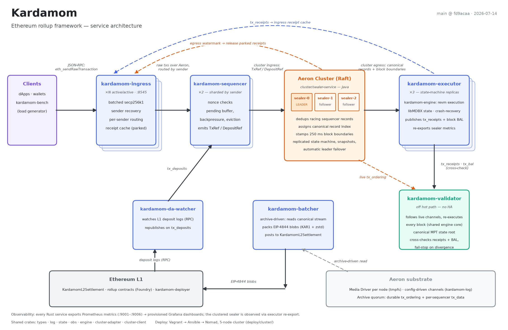
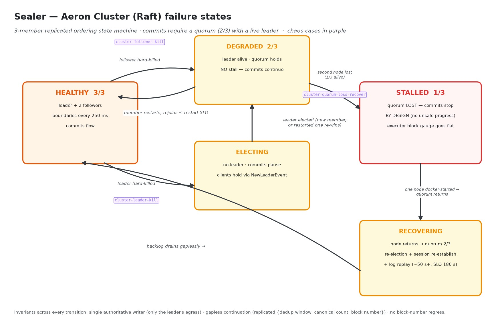
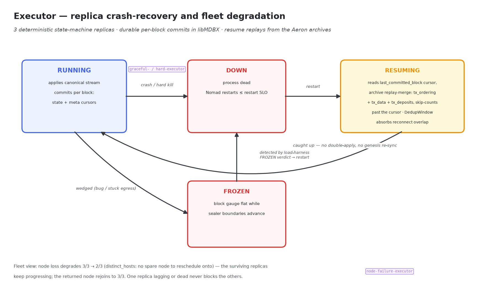
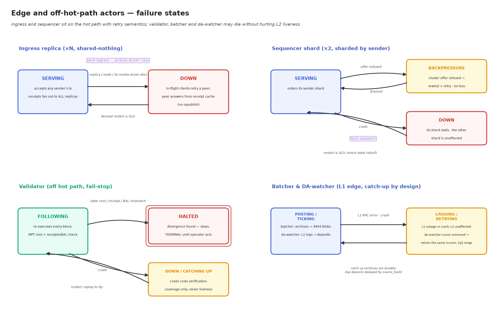

# Failure modes

How each kardamom actor fails, what it costs, how it recovers, and where that
behavior is verified. Grounded in the failover specs (`docs/agents/`), the
chaos suite (`deploy/cluster/scripts/chaos.sh` — case names appear like
`cluster-leader-kill` throughout; most run in CI via
`.github/workflows/cluster-e2e.yml`), and the recovery code itself.

The design in one line: everything on the hot path is either **replicated
shared-nothing** (ingress, executor), **sharded with retry semantics**
(sequencer), or **Raft-replicated with fail-stall-on-quorum-loss** (sealer);
everything off the hot path is allowed to die and catch up (batcher,
da-watcher) or die loudly (validator).

## Sealer — the Aeron Cluster (Raft)

The ordering authority, and historically the hard SPOF: the old standalone
sealer's crash froze every executor permanently (`sealer-hard`, kept only to
reproduce the legacy gap; issue #58). The 3-member Aeron Cluster replaces that
with three distinct, tested modes:

- **Leader hard-kill** (`cluster-leader-kill`) — quorum survives, a leader is
  re-elected (possibly the restarted member re-winning, since it has the most
  up-to-date log — the suite asserts *the pipeline keeps committing*, not
  *the leader changed*), clients redirect via `NewLeaderEvent`. Replicated
  state + snapshots hand the new leader `{dedup window, canonical count,
  block_number}`: no gap, no block-number regress.
- **Follower kill** (`cluster-follower-kill`) — quorum 2/3 holds; **zero
  stall** is asserted and the leader must be unchanged. The member restarts
  and rejoins.
- **Quorum loss** (`cluster-quorum-loss-recover`) — two nodes killed: the
  pipeline **must stall** (the suite asserts the executor block gauge goes
  *flat* — progress without quorum would be unsafe, unreplicated ordering).
  One node returning restores quorum, but this is the one case where client
  cluster *sessions* die (the outage exceeds the session timeout): re-election
  + session re-establishment + log replay takes ~50 s+ observed (SLO 180 s),
  then the backlog drains gaplessly.

## Executor

- **Process crash** (`graceful-executor` / `hard-executor`) — Nomad restarts
  it; startup reads the libMDBX `meta` cursors (`last_committed_block`,
  `last_committed_end_tx_position`) and replays the canonical stream from the
  Aeron archives via a replay-merge, skip-counting past the durable cursor.
  State is committed durably per block, so there is no double-apply and no
  genesis re-sync; the `DedupWindow` absorbs any reconnect overlap.
- **Whole-node loss** (`node-failure-executor`) — with `distinct_hosts` there
  is no spare node to reschedule onto: the fleet degrades 3/3 → 2/3 and must
  keep progressing; the returned node rejoins to 3/3. Replicas are
  deterministic state machines, so one dead or lagging replica never blocks
  the others.
- **Wedged (frozen)** — an executor whose block gauge is flat *while sealer
  boundaries keep advancing* is the load harness's FROZEN verdict; that
  contrast (rather than absolute progress) is what distinguishes a wedged
  replica from a quiescent chain.
- **Leader failover above it** is invisible: the cluster client hides
  reconnects from the reader thread.

## Ingress (×N, active/active)

- **Replica, node, or its media-driver death** (`hard-ingress`,
  `archive-driver-loss`) — costs only that replica's in-flight clients, who
  retry against a survivor. Replicas are shared-nothing (no leader, no sticky
  sessions); any replica can accept any sender's tx.
- **The failure this design had to solve:** a tx accepted by replica A whose
  client retries against replica B. Receipts are multicast to **all**
  replicas (invariant I-B in `docs/agents/resilient-ingress-spec.md`), so B
  answers from its `SeenReceipts` cache without republishing. The dangerous
  mode is a **frozen multicast group** — one stuck subscriber stalling receipt
  fan-out; the `ci-cluster.sh` ingress-churn step reproduces exactly that.
- **Ack-policy window:** the default `on-offer` acks once the tx is offered
  to the pipeline, so a replica dying after the ack but before its
  publication is durable can lose that tx. The `on-quorum` gate (ack only
  after the Raft cluster commits) exists for when that window matters.

## Sequencer (2 shards × 2 racing replicas)

Each shard is served by two active/active replicas on different nodes (Nomad
groups `seq-a`/`seq-b`, cross-placed via `meta.node_index` — see
`docs/agents/replicated-sequencer-shards-spec.md`). Both consume the shard's
`tx_data` multicast stream and both offer byte-identical refs; the cluster's
first-seen dedup keeps one.

- **Replica crash / hard kill** (`sequencer-replica-kill`,
  `graceful-`/`hard-sequencer`) — **no stall**: the twin never stopped. Chaos
  asserts live pipeline progress during the outage and 4/4 allocs back within
  the restart SLO. The restarted replica joins live (no archive replay — its
  twin covered the gap, and replay could overshoot the sealer's dedup window)
  and hydrates nonce floors from committed state.
- **Sequencer node loss** — cross-placement guarantees every shard keeps one
  replica; redundancy (not availability) degrades until the node returns.
- **Both replicas of one shard down** — that shard stalls; this is now the
  double-failure case.
- **Backpressure, not loss** — a refused cluster offer maps to
  `SequencerError::Backpressure` and the rewind/retry path; the failure mode
  is latency, never a dropped record.
- **Racing duplicates are the design** — deduped by the cluster's first-seen
  window on the 32-byte `canonical_id`, with per-sender nonce order preserved
  (per-session order + identical per-replica streams); pinned by
  `crates/sequencer/tests/replicated_shard_racing.rs`.

## Validator (off hot path, fail-stop by design)

The failure philosophy is inverted: **halting is the feature**. On any
divergence — re-executed receipts or BAL disagreeing with the executor's, or
an MPT state-root mismatch — it stops rather than continuing on bad state,
and stays stopped until an operator intervenes. A crashed validator costs
verification coverage, never L2 liveness; nothing on the hot path consumes it.

## Batcher (offline, archive-driven)

A crash costs **DA freshness only** — L2 keeps sequencing and executing.
Because it reads the canonical stream from the durable Aeron archives rather
than live channels, it can restart late and catch up; the failure mode is a
growing L1-posting lag, not data loss. Its real dependencies are archive
availability and L1 gas/RPC health.

When live posting is enabled (`--dry-run=false` with `--l1-rpc`, `--l1-key`,
`--settlement`, `--da-store`) it broadcasts each batch as a real EIP-4844 blob
transaction to `KardamomL2Settlement`: L1 records the ordering + KZG versioned
hashes, and the blob **bytes** are written to the DA store keyed by versioned
hash (mirroring the EL-holds-commitments / DA-layer-holds-bytes split, since
blob sidecars are pruned by the consensus layer after ~18 days).

## Data-availability recovery (rebuild-from-L1)

The bottom-of-the-stack backstop: even if **every** in-cluster durable copy is
lost — the Raft log on a quorum of sealers *and* every node's `tx_ordering` /
`tx_data` archive — the L2 state is still recoverable from L1 alone, because the
posted blobs carry the full ordered `raw_tx` stream.

`kardamom-reconstruct` walks the `BatchPosted` event log, fetches each batch's
blobs from the DA store by the versioned hashes L1 committed to, decodes the
KAR1 payload back into ordered blocks, and re-executes them through the **same**
engine the live executor/validator use (`kardamom_engine::replay`) into a fresh
trie-aware state DB. Because the state root is a pure function of genesis + the
ordered transactions (receipts and canonical positions don't enter the trie),
the reconstructed root is byte-identical to the canonical one. The
`reconstruct_l1_e2e` test proves the whole loop end-to-end against a real L1
(anvil): post → discard the originals → read L1 → fetch blobs → re-execute →
assert root parity.

Scope: L2 transactions. Deposits are absent from the DA payload (the batcher
skips `DepositRef`s) but are independently re-derivable from L1 `DepositInitiated`
events via the `da_watcher` path — interleaving them into the reconstruction is
a documented follow-up, so a deposit-bearing range currently reconstructs its
non-deposit state exactly and is flagged rather than silently diverging.

## DA-watcher

Tick-based with an in-memory cursor: any RPC or publish error leaves the
cursor unadvanced and the next tick retries the same `(cursor, tip]` range —
at-least-once within a run. Duplicates after a retry or restart are absorbed
downstream by the first-seen dedup on `source_hash`. A dead watcher stalls
deposits only, and it reads *finalized* L1 blocks, so reorgs are out of scope
by construction.

## Substrate (the shared failure domain)

- **ArchivingMediaDriver** — one combined Media Driver + Archive JVM per node
  (the `aeron` Nomad system job). A driver death takes down every service on
  that node in one blow: transport *and* that node's durability recorder.
  `archive-driver-loss` kills it under ingress-0 and asserts the pipeline
  rides through (active/active), the system task restarts within the SLO
  (archive segments persist on the node volume), and the ingress job returns
  to full strength.
- **Archives** — durable `tx_ordering` (folded into the Raft log + per-member
  archive) and per-sequencer `tx_data`; they underpin executor resume and the
  batcher. `tx_data` is **already 2× node-redundant**: it is a UDP-multicast
  stream, and both ingress replicas run an archive recorder that joins the group,
  so each ingress node's archive captures *every* publisher's shard streams. The
  two archives are byte-identical (same recording ids + segment checksums), which
  makes the peer an exact restore source. What was missing — and what
  `archive-tx-data-wipe` + `kardamom-archive-rereplicate` add — is the path back
  to full redundancy after a loss: a wiped node's archive is restored by
  file-mirroring the surviving peer's segments + catalog (rusteron-archive does
  not expose Aeron's network `replicate()`), and the restored archive passes
  Aeron's own `ArchiveTool verify`. Without it, losing one copy leaves the *next*
  loss fatal, and a volume wipe hangs the executor's `resolve_recording`.

## Known gaps (untested failure surface)

- **Archive *data* loss** — total loss has the rebuild-from-L1 path (above,
  `reconstruct_l1_e2e`); single-node `tx_data` archive loss has the
  re-replicate-from-peer path (`archive-tx-data-wipe` chaos case +
  `kardamom-archive-rereplicate`). Still open: `tx_ordering` archive re-replication
  (today it self-heals only via the Java cluster's Raft log replication on
  rejoin), and executor resume against a partially-missing (not fully wiped)
  segment set.
- **Deposit interleaving in reconstruction** — rebuild-from-L1 covers L2
  transactions; re-deriving L1 deposits from `DepositInitiated` events and
  interleaving them in canonical order is a follow-up.
- **L1 outage** — the batcher's behavior under sustained L1 RPC failure /
  gas spikes is designed (lag + catch-up) but not chaos-tested.
- **Validator divergence injection** — fail-stop is unit-tested, but no e2e
  case feeds the validator a corrupted receipt/BAL stream.
