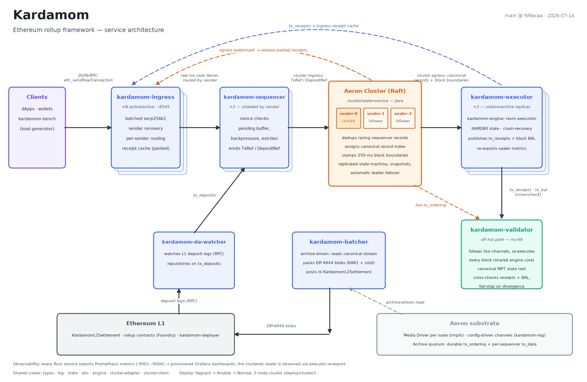
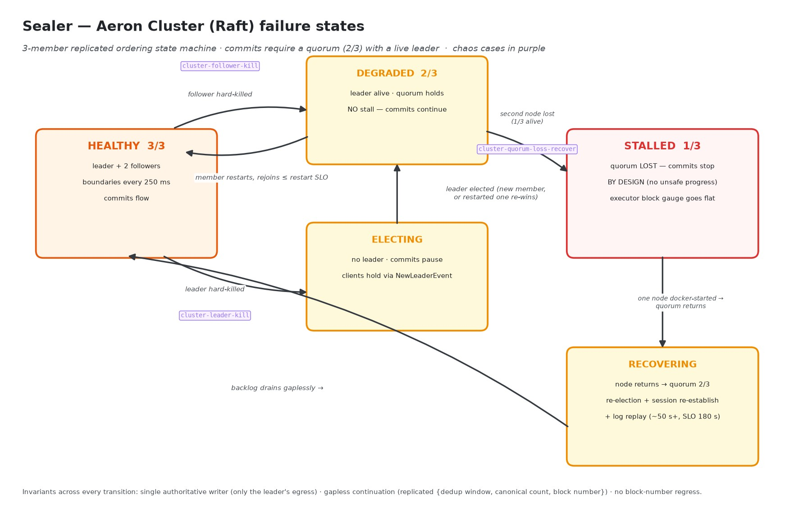
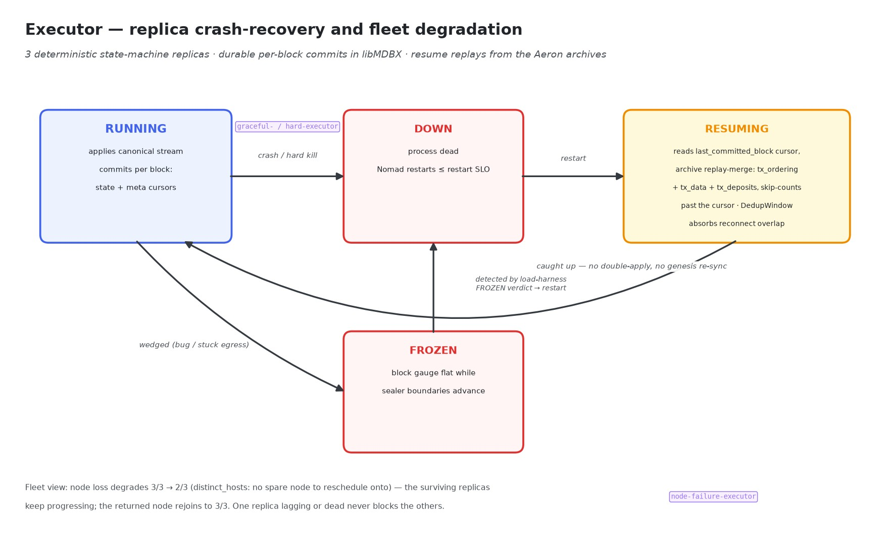
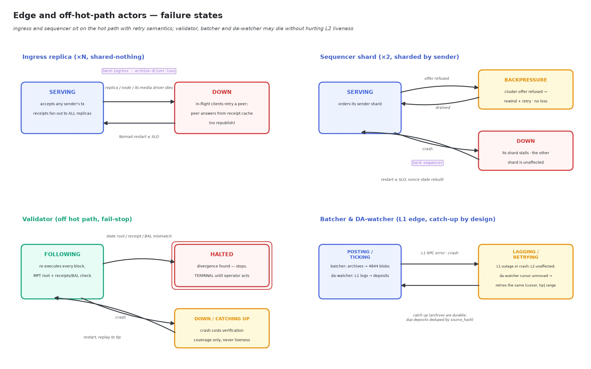

# Failure modes

This document says how each kardamom actor fails, what the failure costs, how the actor recovers, and which test proves it.

- Each failure mode lists four things: the trigger, the effect, the recovery, and the proof.
- The proof is a chaos case name (for example `cluster-leader-kill`) or a test name.
- The chaos suite is in `crates/chaos`. One function implements one case.
- Most cases run in CI through `.github/workflows/cluster-e2e.yml`.
- [`chaos-suite.md`](chaos-suite.md) gives the shards, the gates, the load verdict and the knobs.
- The failover specs in `docs/agents/` are further reading.

Chaos answers the question "does the pipeline survive faults under load?".
The **chain-semantics suite** answers the question "does the chain mean the right thing?".

- The suite checks bridge round-trips, nonce ordering, validator and executor parity, DA parity and state-DB integrity.
- It runs on a single-host stack (`just test-e2e-local`).
- It runs on the same DinD cluster (the `semantics` shard).
- The spec is [`agents/chain-semantics-e2e-suite-spec.md`](agents/chain-semantics-e2e-suite-spec.md).

The design in one line:

- Everything on the hot path is **replicated shared-nothing** (ingress, executor).
- Or it is **sharded with retry semantics** (sequencer).
- Or it is **Raft-replicated with fail-stall on quorum loss** (sealer).
- Everything off the hot path can die and catch up (batcher, da-watcher).
- Or it halts with a named cause and stays up (batcher, da-watcher, l1-indexer, validator, the epoch lane of the sequencer). See "Halts and service events".

## Halts and service events

A **halt** is a service that stops its work, stays up, and names its cause. A **pause** is a service that waits on a halt of another service. This section covers the halt record, the routes, the causes, the service events and the DA-lag guard.

### The halt record

- A halt has five fields: `cause`, `detail`, `recovery`, `since_unix_ms` and `clears`.
  - `detail` holds the numbers: the block, the hashes, the cursor and the floor.
  - `recovery` is the id of the runbook.
  - `clears` is `auto` or `operator`.
  - An `auto` halt ends when the service retries its cause on a backoff and the cause is gone.
  - An `operator` halt waits for the operator to do the runbook steps and clear it.
- Each exporter serves the halt on its metrics port.

| Route | Method | Effect |
|---|---|---|
| `/halt` | GET | The JSON record. It has the five fields, `runbook`, `state`, `halted` and `pause`. |
| `/ready` | GET | 503 while a halt or a pause stands, on top of the readiness rule of the service. |
| `/halt/clear` | POST | Ends the halt. |
| `/pause?note=` | POST | Pauses the service for an operator. |
| `/resume` | POST | Ends a pause. |

- The three POST routes accept a loopback peer only. Any other peer gets 403. Run them on the node of the service.
- The state is one of `running`, `halted`, `paused` and `resumed`.
- A clear of an `auto` halt does no harm. The service raises the halt again on its next failed retry.
- The gauge is `kardamom_halt{service,cause,recovery}`. It is 1 while the halt stands and 0 after it clears. The exporter adds `service` and `host_id` to every series.
- `docs/runbooks/` holds one runbook for each `recovery` id. Each runbook has the sections Cause, Confirm, Steps and Clear. The [runbook index](runbooks/README.md) lists the ports.
- Unit tests check that each recovery id has a runbook with four sections, that each cause has one alert rule, and that the inhibit rule exists.

### Causes

| Cause | Service | Clears | Runbook |
|---|---|---|---|
| `l1_source_disagreement` | da-watcher, l1-indexer | auto | [`l1_source_disagreement`](runbooks/l1_source_disagreement.md) |
| `l1_chain_break` | da-watcher, l1-indexer | auto | [`l1_chain_break`](runbooks/l1_chain_break.md) |
| `l1_unreachable` | batcher, da-watcher, l1-indexer | auto | [`l1_unreachable`](runbooks/l1_unreachable.md) |
| `replay_unavailable` | batcher | operator | [`replay_unavailable`](runbooks/replay_unavailable.md) |
| `da_lag` | sealer (raised by the ingress) | auto | [`da_lag`](runbooks/da_lag.md) |
| `sealer_no_quorum` | sealer (raised by the ingress) | auto | [`sealer_no_quorum`](runbooks/sealer_no_quorum.md) |
| `validator_divergence` | validator | operator | [`validator_divergence`](runbooks/validator_divergence.md) |
| `l1_cursor_unreadable` | da-watcher | operator | [`l1_cursor_unreadable`](runbooks/l1_cursor_unreadable.md) |
| `origin_gap` | sequencer | auto | [`origin_gap`](runbooks/origin_gap.md) |

- The sealer is a Java service with no Rust exporter. The ingress observes the sealer and raises its halts under `service="sealer"`.
- The sections for the sequencer, the batcher, the da-watcher and the validator describe how each one reaches its halts.

**The `revert_to_posted_head` runbook.** It has no cause. The `replay_unavailable` runbook sends the operator to it.

- It is the last resort. Use it only when no copy of the unposted range survives.
- The chain reverts to the posted head. Every receipt in the reverted range is revoked.
- The steps, in order:
  - Stop the ingress replicas and the da-watcher.
  - Take a consistent cut of the cross-chain lanes.
  - Roll back the L1 outputs that are past the cut.
  - Rebuild the state at the posted head from L1 and the DA layer.
  - Reset the sealers, install the rebuilt state on the executors and the validator, and reset the da-watcher and the batcher.
  - Start the ingress replicas.
- The runbook is [`revert_to_posted_head`](runbooks/revert_to_posted_head.md).

### Service events

Each service publishes its lifecycle state on the `events` stream. The stream gives a live view of every halt and pause in the cluster.

- **Stream.** The stream id is 1019. A record has the fields `service`, `instance`, `seq` and `state`.
- **Delivery.** Delivery is best effort and RAM only. The term length of the stream is 64 KiB.
- **Timing.**
  - A service publishes its state every 5 s, and on each change.
  - A record is `gone` after 15 s with no heartbeat.
  - A `gone` record leaves the board after 5 min.
  - A cluster session that sees no boundary for 10 s calls the sealer halted on a lost quorum.
- **Publishers.** The ingress, the sequencer, the executor, the validator, the batcher, the da-watcher and the state-mirror.
  - The validator also publishes the attester as `service="attester"`.
- **Subscribers.** The ingress and the validator. Other services do not subscribe.
- **The sealer is not on the stream.** The ingress observes it from the status frame (see "DA-lag guard") and from silence. It publishes the sealer as `sealer/cluster`.
- **The l1-indexer is not on the stream.** It has no Aeron runtime. Its halt is on its own `/halt` route and on the `indexer_halt` JSON-RPC method.

| Root | Reaction |
|---|---|
| Sealer `sealer_no_quorum` | The ingress sets the root after 10 s with no status frame. It pauses submits. The sequencer pauses after 10 s with no boundary. Its publish loop offers nothing until a boundary returns. |
| Sealer `da_lag` | The ingress pauses submits. Deposits and boundaries continue. |
| Every executor halted | The ingress pauses submits. |
| Validator `validator_divergence` | The attester pauses while any live validator is halted on this cause. |
| Batcher halted | The chain status shows `batcher_halted`. |
| da-watcher halted | The chain status shows `deposits_delayed`. |
| l1-indexer halted | `kardamom-reconstruct` refuses to rebuild from that indexer. |

- No executor raises a halt yet. The executor publishes only its lifecycle. The row "every executor halted" has a reaction in the ingress and a unit test, and it has no producer.
- A paused service resumes by itself when the root clears. Follow the runbook of the root, not of the paused service.
- The ingress answers `kardamom_chainStatus` with the heads, the roots and the state of each service. See [`json-rpc.md`](json-rpc.md).

### Pause routes and alerts

- `POST /pause?note=<text>` pauses a service for an operator. `POST /resume` ends the pause. Both accept a loopback peer only.
- The gauge is `kardamom_paused{reason,root_service,cause}`. It is 1 while the pause stands.
  - `reason` is `upstream` or `operator`.
  - For an upstream pause, `root_service` and `cause` name the root.
  - For an operator pause, `cause` is `operator`.
- Each cause has a critical alert, `KardamomHalt<Cause>`. It fires at once on `kardamom_halt{cause="<id>"} == 1`.
  - `KardamomHaltOriginGap` waits 1 minute. A twin sequencer fills a gap within milliseconds, so only a gap that no replica fills pages.
- `KardamomServicePaused` is an info alert on `kardamom_paused == 1` for 1 minute.
- The inhibit file `deploy/alertmanager-inhibit.yml` mutes `KardamomServicePaused` while a `KardamomHalt*` alert with the same `cause` fires.
  - One incident pages once, with the runbook of the root.
  - An operator pause has `cause="operator"`, so the inhibit rule never mutes it.
- No job loads the inhibit file. Copy it into the `alertmanager` item of the Nomad variable `nomad/jobs/monitoring`, beside your routes and receivers.
- The alert detail is in [`observability.md`](observability.md).

### DA-lag guard and posted-head retention floor

The sealer refuses user records when the batcher falls too far behind on L1. The sealer also keeps every frame that L1 does not hold yet.

- **Posted head.** The batcher sends its confirmed cursor to the sealer at start and on every change. The sealer keeps it in the replicated state.
- **Guard.** The sealer refuses a user record when the budget is above 0 and the sealed head is more than the budget past the posted head.
  - Deposits and boundaries still enter.
  - The sealer answers the refused record with a reject frame. The sequencer maps it to the transaction error `DaLag`.
  - The default budget is 10,000 blocks. A budget of 0 turns the guard off.
  - The setting is `-Dkardamom.cluster.daLagBudgetBlocks`, or the env var `DA_LAG_BUDGET_BLOCKS`. The property wins. Every member must use the same value.
- **Status frame.** The sealer sends a status frame to every session. The frame has the posted head, the sealed head, the budget, a halted flag, the retained frame count and the floor.
  - The ingress mirrors the frame in the gauges `kardamom_ingress_cluster_posted_head`, `_sealed_head`, `_retained_frames` and `_floor_block`.
  - The ingress raises `da_lag` while the frame says halted, and clears it when the frame says not halted.
  - Any status frame ends a `sealer_no_quorum` halt.
- **Retention floor.** `kardamom.cluster.retention` is a minimum, not a maximum.
  - A frame past the window leaves only when its block is at or below the posted head.
  - The batcher can always replay from its cursor.
  - The guard bounds the growth. The stretch is at most the budget plus one flush, in heap.
  - The retained frames are in the snapshot. A restored member keeps the floor at the posted head.
- The wire layouts are in [`../cluster/sealer-service/README.md`](../cluster/sealer-service/README.md).
- Proof: `da-lag-halt` and `prune-floor`. Both run by name with `KARDAMOM_CHAOS_CASES`. They are in no shard.
  - `da-lag-halt` freezes the batcher and lets the sealed head pass the budget. It needs `KARDAMOM_DA_LAG_BUDGET_BLOCKS`, set to the small budget that the cluster runs with.
    - It asserts that the chain refuses a new transaction with the typed error.
    - It asserts that the chain status shows the sealer halted on `da_lag` as the root, and the ingresses paused on it.
    - It asserts that the chain resumes with no operator step when the batcher thaws and posts.
  - `prune-floor` freezes the batcher past the retention window and a Raft snapshot. It needs `KARDAMOM_CLUSTER_RETENTION`.
    - It asserts that the sealer replays from the cursor of the batcher, with no refused replay.
    - It asserts that the record on L1 is contiguous and that the retention is back inside its window.

## The recovery probe

Every chaos case ends with a **recovery probe**.

- The case load ended and the executors converged.
- Two 30 s loads then run at the same time. Each load runs at half the case rate.
- Load 1 runs on the account of the case, from its next nonce. It uses the ingress that the case load used. It stands for a sender that had transactions in flight during the outage.
- Load 2 runs on the account of the smoke gate. No case load spends that account. It uses the other ingress. It stands for a sender with nothing in flight.
- Every offered transaction of both loads must get a receipt.
- Each load must be accepted at a quarter of its rate or more.
- If load 1 alone fails, a sender is stuck.
- If load 2 fails, the pipeline or an ingress did not recover.
- The case load cannot prove either point. A submit that the ingress refuses during the outage leaves a nonce hole. Every later submit of that sender parks and fails. The chaos verdict does not count a failed submit.
- The executor block gauge cannot prove either point. It advances on empty blocks.
- See [`chaos-suite.md`](chaos-suite.md) for the gates.

## Sealer: the Aeron Cluster (Raft)

The sealer is the ordering authority. Three members form an Aeron Cluster. The cluster has these failure modes.

- **Leader hard-kill**
  - Trigger: the leader process dies.
  - Effect: the quorum survives. The members elect a leader. The restarted member can win again, because it has the most up-to-date log.
  - Recovery: clients redirect through `NewLeaderEvent`. The replicated state and the snapshots give the new leader the dedup window, the canonical count and `block_number`. There is no gap and no block-number regress.
  - Proof: `cluster-leader-kill`. The case asserts that the pipeline keeps committing. It does not assert that the leader changed.
- **Follower kill**
  - Trigger: one follower dies.
  - Effect: quorum 2 of 3 holds. There is no stall.
  - Recovery: the member restarts and rejoins.
  - Proof: `cluster-follower-kill`. The case asserts zero stall and an unchanged leader.
- **Member state loss**
  - Trigger: a member comes back with no Raft recording log: its directories are wiped, or its node is replaced.
  - Effect: the member must not start at log position 0 in a running cluster. It could not catch up after the leader purges its log. Blank members that elect each other would start a second history.
  - Recovery: before it launches, the member copies the latest snapshot, and the log after it, from a peer (an Aeron ClusterBackup).
    - It restores the snapshot and catches up from the leader.
    - A blank member starts at position 0 only during the bootstrap of a new cluster (`KARDAMOM_CLUSTER_BOOTSTRAP=1`).
    - Without a peer, the member waits and logs `cluster SEED waiting-for-peer`. It never falls back to position 0.
    - See [Start modes](../cluster/sealer-service/README.md#start-modes).
  - Proof: `cluster-member-rejoin` and `node-replace-sealer`. Each case checks that the member starts blank, then reaches the head that the executors had at the wipe.
- **Raft log purge**
  - Rule: each member purges its own Raft log below a purge point. The purge point is the newest snapshot that obeys two rules:
    - It is older than the 3 newest snapshots (`kardamom.cluster.logPurgeKeepSnapshots`, env `KARDAMOM_CLUSTER_LOG_PURGE_KEEP`). The value 0 turns the purge off.
    - The batcher has posted its block.
  - Effect: the log keeps every block that the batcher has not posted. At the 300 s snapshot interval, the log keeps 15 minutes or more.
  - Recovery: a follower that stops for a shorter time rejoins from its own log. A blank member seeds from a peer.
  - The purge logs `cluster LOG PURGED memberId=.. position=.. block=.. postedHead=..`.
  - Proof: the in-JVM tests `ClusterLogPurgeTest`.
- **Follower below the purge point**
  - Trigger: a follower stops for longer than the purge margin. It restarts with a log that ends below the purge point of the leader.
  - Effect: the archive of the leader refuses the catch-up of the follower. The election of the follower cycles, while Nomad sees a live container.
  - Recovery: the join watchdog acts after 300 s with no commit progress (`kardamom.cluster.catchupStallS`, 0 turns this rule off).
    - It logs `cluster CATCHUP STALL`.
    - It deletes the recording log of the member and exits with code 4.
    - The relaunch finds no recording log. So the member seeds from a peer and rejoins.
    - The member holds no committed entry that the leader does not have, because it was behind the leader.
  - Proof: the in-JVM tests `ClusterLogPurgeTest` and `JoinWatchdogTest`.
- **Quorum loss**
  - Trigger: two members die.
  - Effect: the pipeline must stall. Progress without a quorum would be unreplicated ordering, which is unsafe. Client cluster sessions die, because the outage is longer than the session timeout.
  - Recovery: one member returns and restores the quorum. The cluster elects a leader, the clients open new sessions, and the members replay the log. This takes about 50 s or more (SLO 180 s). The backlog then drains with no gap. The second member returns last, and the pipeline progresses with all three members.
  - Proof: `cluster-quorum-loss-recover`. The case asserts that the executor block gauge goes flat.
- **Total loss**
  - Trigger: all three members die.
  - Effect: no member is left. The pipeline must stall.
  - Recovery: every member returns with its own log and snapshots. The members elect a leader among themselves. The backlog drains.
  - Proof: `cluster-total-loss-recover`.
  - Not covered in-cluster: three wiped members. No peer holds a snapshot for them. The members start from a seed rebuilt from L1. See "Sealer fleet rebuild (every sealer wiped)". The proof of that path is `sealer-fleet-total-wipe-recover`.
- **Epoch lost in a leader change**
  - Trigger: a leader kill or a quorum loss. Cluster ingress is at-most-once across them. An offer that the ingress publication accepted can still be lost.
  - Effect: once the sealer holds an L1 origin, it accepts only the epoch of L1 block `l1_origin + 1`.
    - It answers any other epoch with an `ORIGIN_GAP` reject (egress kind 12) that names the expected block. Only the offering session gets the reject.
    - It logs `cluster ORIGIN-GAP`.
    - The check reads only replicated state, so every member refuses the same epoch.
  - Recovery: the sequencer keeps every epoch that it relayed until a boundary carries its L1 block.
    - On the reject, it offers its epochs again from the expected block, in order. The dedup absorbs the copies.
    - The da-watcher follows the boundaries too. When no boundary confirms its published epochs for 30 s, it publishes them again. This fills a sequencer that restarted and lost its queue.
    - A lost epoch delays deposits by one round trip, or by one re-publish period. The sealer never seals over it.
  - The first epoch at genesis, or after a seed with origin 0, can start at any L1 block. After a seed with origin `M`, the next epoch is `M + 1`.
  - Proof: the in-process test `OriginGapClusterTest`, with `a_republish_from_the_boundary_origin_refills_a_lost_epoch_in_either_order`.
- **Torn archive fragment at launch**
  - Trigger: a hard kill leaves a torn last fragment in the archive. The launch then fails with `incomplete last fragment straddling page boundary`.
  - Effect: the launch attempt fails.
  - Recovery: the sealer runs `ArchiveTool.verify` with truncation on the archive directory. It then launches again, within the attempt bound. The log line is `cluster LAUNCH REPAIR`. The truncated bytes are the unacknowledged tail of the member. The leader fills the gap when the member rejoins.
- **Back-pressured client session**
  - Trigger: a client session does not take its egress frames. A wedged client is the usual cause.
  - Effect: the service thread must not wait. It also runs the boundary tick and relays records for every session.
  - Recovery: the leader queues the frames of that session in a backlog and keeps the order of the frames.
    - The leader closes the session once when its backlog sends no frame for 1 s, or holds more than 64 MiB. It logs `cluster EGRESS-CLOSE` with the reason.
    - The client reconnects and replays. Other sessions get every boundary in order.
    - A role change drops all backlogs. The clients replay from the new leader.
    - See [Egress back-pressure](../cluster/sealer-service/README.md#egress-back-pressure).
  - Proof: the in-process tests `SealerEgressCloseTest` and `SessionBacklogsTest`.
- **Silent egress on a client session**
  - Trigger: a cluster session receives no egress frame. This happens after a quorum loss, when a restarted leader stops serving a surviving session.
  - Effect: the client offers into a void. A publisher-only client, such as a sequencer, has the same risk as a consumer.
  - Recovery: an egress-silence watchdog runs for every cluster session, publisher-only sessions included.
    - The first window is 10 s.
    - Each fruitless reset doubles the window, up to 60 s.
    - Any real egress frame resets the window to 10 s.
    - A forced reset leaves the old server session in place for up to the 90 s session timeout.
    - The doubling keeps the churn of old sessions below the reap rate.

### Removal of an entry that no consumer can execute (void)

The sealer orders a transaction reference before the archives make its data durable. A failure such as the blackout can leave an entry with no data. The sealer can remove such an entry with a canonical *void record*. The rule has no clock in it.

- A consumer votes (`KIND_VOID_REQUEST`) only after the join budget ends and every archive refuses the range.
  - An archive refuses when it has no recording of the session, when each recording starts after the range, or when the range is in a gap or after an ended recording.
  - An archive that is down or slow does not refuse. A live recording that does not reach the range yet does not refuse.
- A consumer that has the data never votes.
- The sealer appends the void record only when **every** configured voter has voted for the same `(index, tx_hash)`.
- One voter that is down blocks the void, and the chain waits for it. This is the safe side, because that voter can be the one that executed the entry.
- On a void, the sealer removes the hash from its dedup window. It sets the expected nonce of the sender back. The sender can submit the same bytes again.
- A sender gets no notice of a void. The receipt never comes, and the sender submits again.

Three constants bound the rule. Every sealer member must run the same values.

| Setting | Default | Meaning |
|---|---|---|
| `kardamom.cluster.voidVoters` (env `KARDAMOM_VOID_VOTERS`) | empty | The voter ids. An empty list refuses every vote. |
| `kardamom.cluster.voidWindow` | 65536 (the egress retention) | The newest indices that a void can name. An older entry cannot be removed. |
| `MAX_OPEN_VOTES` | 1024 | The most indices with open votes. More are refused. |

- The order path pays one 52-byte copy for each reference and no allocation.
- The votes and the window are in the sealer snapshot. With voters configured, a full window adds 65536 x 68 bytes (about 4.4 MB) to each snapshot.
- A void needs the last vote before `voidWindow` more records are ordered after the entry.
- With live ingress above about 1000 records per second and a 60 s join budget, the entry leaves the window first. The chain then stops.

The voter list must equal the set of consumers that execute.

| Consumer | Flag and env | Voter id in the deploy |
|---|---|---|
| Executor `i` | `--void-voter-id`, `KARDAMOM_VOID_VOTER_ID` | `i`, its allocation index |
| Validator | `--void-voter-id`, `KARDAMOM_VOID_VOTER_ID` | `executor_count` |
| Batcher | `--void-voter-id`, `KARDAMOM_VOID_VOTER_ID` | `executor_count + 1` |
| Sealer | `kardamom.cluster.voidVoters` | the range of `0` to `executor_count + 1` |

- A consumer with no voter id never votes.
- A consumer outside the list cannot stop a void.
- If that consumer executed the entry, it stops with `VoidOfExecutedEntry` when it reads the void record.
- A consumer repeats its vote every 5 s.
- A consumer waits 120 s for the void record and then restarts. The sealer keeps the vote.
- When the join times out, the warning line has the field `every_archive_refused`. The value `true` means the data is gone. A restart meets the same entry again.

### Durability of the Raft log

The kill-based cases prove the restart logic. They do not prove durability against a power loss. A process kill or a container kill leaves the host kernel and its page cache alive. Every member finds its whole log again.

- The sealer syncs the Raft log and the archive to disk with `kardamom.cluster.fileSyncLevel`.
- Level 0 does not sync. Level 1 syncs the data of every write batch. Level 2 is also valid. Any other value refuses to start.
- The code default is 0. The deploy sets 1 (Nomad variable `cluster_file_sync_level`, env `KARDAMOM_CLUSTER_FILE_SYNC_LEVEL`).
- At level 0, an entry that a quorum acknowledged can exist only in the page caches of its members. A rack-level power loss would drop it. `pipeline-blackout-recover` stands for that event.
- Only a test that cuts the power of a VM can prove this end to end.

## Executor

The executors are deterministic state machines. One dead or lagging replica never blocks the others.

- **Process crash**
  - Trigger: the executor process dies.
  - Recovery: Nomad restarts it. The start reads the libMDBX `meta` cursors (`last_committed_block`, `last_committed_end_tx_position`). The executor replays the canonical stream from the Aeron archives through a replay-merge. It skip-counts past the durable cursor.
  - Result: the state is committed durably per block. There is no double apply and no genesis re-sync. The canonical-index cursor of the cluster subscription drops any reconnect overlap.
  - The executor has no dedup window. The sealer is the only dedup point.
  - The state DB has schema version 3 (`SCHEMA_VERSION`). A DB with an older version is refused. The node then restarts from genesis.
  - Proof: `graceful-executor`, `hard-executor`.
- **Whole-node loss**
  - Trigger: a node dies. With `distinct_hosts`, no spare node exists.
  - Effect: the fleet degrades from 3 of 3 to 2 of 3. It must keep progressing.
  - Recovery: the returned node rejoins. The fleet is again 3 of 3.
  - Proof: `node-failure-executor`.
- **Whole-fleet loss**
  - Trigger: all three executor nodes die at once. Every exporter is dark.
  - Recovery: all three return. Each executor resumes from its own state directory. It catches up on the backlog that the sealers kept ordering, inside the canonical retention window.
  - Proof: `executor-fleet-loss-recover`.
- **Whole-fleet state loss**
  - Trigger: all three executor tasks die and every state DB is wiped. Each node keeps its own checkpoints.
  - Effect: no peer is live to serve a checkpoint.
  - Recovery: every executor restores from its local checkpoint and replays the tail.
  - Proof: `executor-fleet-wipe-recover`. The case hard-kills the three tasks, stops the executor job, wipes every state DB while no executor runs, and starts the job again. It requires one restore line per executor. The job stop keeps Nomad from restarting an executor before its wipe.
  - Not covered: three executors wiped with their checkpoints. The source is then the rebuild from L1 (next item).
- **Whole-fleet total loss**
  - Trigger: the executor job stops, and every state DB and every checkpoint is wiped. No executor holds state, and no peer can serve any.
  - Recovery:
    - The harness rebuilds an executor image from L1 and the DA proxy on the host (`kardamom-reconstruct --through-block --executor-image`).
    - It installs the image on every executor node and starts the job.
    - Every executor resumes from the cursor of the image. The replay request is one that the sealer accepts. There is no checkpoint restore and no peer fetch.
    - The fleet catches up.
  - Proof: `executor-fleet-total-wipe-recover`. The end-of-shard audit compares the resumed executors with the validator table by table.
  - The job is stopped, not killed. An executor that starts on an empty directory of a young chain replays from genesis on its own.
- **Machine replacement**
  - Trigger: the node is replaced through the Terraform root, as a cloud provider replaces a server. The new node has a new address and empty volumes. It then gets the substrate play.
  - Recovery: Consul forgets the old record (the control node force-leaves it). Nomad places the lost executor on the new client. The executor catches up from nothing. Only the address plan of the root moves, because every peer resolves the node by name.
  - Contrast: a restarted node (`node-failure-executor`) keeps its address and its disks. This path loses both.
  - Proof: `node-replace-executor`.
- **State-DB volume loss**
  - Trigger: the state DB is wiped. The process did not only crash.
  - Effect: without a checkpoint, the executor must replay the whole canonical stream from genesis. That cost is unbounded as the chain ages.
  - Recovery: with `--checkpoint-dir`, the executor writes periodic consistent snapshots (`compact_to`, an online read-only copy that never blocks the writer). On a cold start with an empty state directory, it restores the newest checkpoint before it opens the env. The normal resume path then replays only the short tail. The replicas are deterministic at the same block, so the checkpoint of a **peer** is a valid restore source.
  - Proof: `state-checkpoint-restore`. The case wipes the state of executor-0 and re-replicates the checkpoint of executor-1. It asserts that executor-0 restores from that checkpoint, not from genesis, and rejoins.
- **Replay-window overrun**
  - Trigger: the cluster keeps a bounded canonical window (`kardamom.cluster.retention`, default 65,536 frames, about 5 minutes at 200 tps). A `REPLAY_FROM` below the floor of the window is refused with `REPLAY_UNAVAILABLE`. The window is a minimum. A frame past it stays until L1 holds its block (see "DA-lag guard and posted-head retention floor"). The retained frames are in the cluster snapshot, so a member that restores from a snapshot keeps the floor at the posted head. A cursor that is older than the window is the trigger.
  - Effect: the refusal is terminal for the local state. A cursor below the floor can never catch up. A fresh or wiped node cannot re-sync from genesis either, because genesis aged out of the window.
  - Recovery: the executor repairs itself with peer state.
    - Each replica serves its newest checkpoint over `--checkpoint-serve-addr` (`:9014`).
    - A node that hits the refusal, or cold-starts with no checkpoint, fetches the newest qualifying peer checkpoint (`--checkpoint-peers`).
    - It parks the stale DB under `<state_dir>/stale/`, restores, and resumes from the cursor of the checkpoint.
    - All of this runs in the same process. The cost is one fetch and one restore. It burns no restart attempt of the orchestrator.
    - `kardamom_executor_resync_total` counts these repairs by outcome.
  - If no peer offers a checkpoint at or above the floor, the node stays down and says so. The remaining paths are an operator-restored checkpoint or the rebuild from L1 (`kardamom-reconstruct`).
  - Proof: `replay-window-resync`. The `retention-overrun` case (`chaos-retention` shard) freezes one executor past a small retention. The shard deploys that retention. The executor must adopt a peer checkpoint.
- **Wedged executor**
  - Trigger: the block gauge of an executor is flat while the sealer boundaries keep advancing.
  - Effect: this contrast is the FROZEN verdict of the load harness. It tells a wedged replica from a quiescent chain. Absolute progress does not.
- **Leader failover above the executor** is invisible. The cluster client hides reconnects from the reader thread.

### The executor stream: the executor records what it joins

Each executor publishes the transactions that it joins on the executor stream (`exec_txs`), in canonical order. The archive on the node of the executor records the stream. See [aeron-discovery.md](aeron-discovery.md) for the two publications.

- **Start**: the executor opens its recorded IPC publication and starts its recording on the local archive. It joins nothing before that recording of its own session is active. A recording that does not start within 60 s fails the start. Nomad then restarts the executor.
- **Order**: the reader sends each joined record to the stream before it sends the record to execution. The reader also sends a progress mark after each message that takes a slot.
- **Archive back-pressure or archive loss**: the recorded publication refuses the record. The publisher offers it again until the archive takes it. The channel from the reader fills, and the reader blocks. This executor stalls. It drops no record, and it never executes a record that its archive did not take. The other executors carry the chain. `kardamom_executor_exec_stream_publish_blocked_ms_total` counts the wait.
- **Restart**: a restarted executor gets a new Aeron session, so its archive makes a new recording. The recording of the earlier session stays in the archive. `kardamom_executor_exec_stream_session_id` shows the new session.
- **Recorded cursor**: `kardamom_executor_exec_stream_recorded_index` is the highest canonical index whose records the local archive has written. It never passes the recording position. At archive sync level 1 it is durable on the node. At level 0 it survives a crash, not a power loss. Nothing reads the cursor yet.
- **Locator log**: `<state_dir>/exec_stream/locators.log` maps a canonical index to a session and a position in a recording: one entry for the first record of each session, then one entry every 1024 records. A torn last entry is cut at the next start, and a lookup then takes the previous entry, a lower bound. A checkpoint restore or a parked state starts a new log. Nothing reads the log yet.
- **Recording loss**: the recorder thread reads the recording position every 20 ms. When no read succeeds for the loss wait, the driver timeout of the archive client (`AERON_DRIVER_TIMEOUT`, the Aeron stall tolerance: 10 s by default, 30 s in CI) plus 5 s, and at least 10 s (the recording stopped, or the archive no longer answers), the recorder thread ends and logs `exec_txs recorder ended: the local recording is lost`. The publisher then fails, also during a wait for a refused record. The reader stops with an error, and the process exits. Nomad restarts it, and the start waits for a recording of the new session. An executor never runs without a recorded copy of what it joins. A stall that every Aeron party survives does not end the recorder. The start budget of an Aeron client uses the same rule.
- **Shared media driver**: the recorded publication is exclusive. Each executor has its own session and its own recording, also when several executors share one media driver (the single-host e2e stack).
- Proof: `graceful-executor` and `hard-executor` assert that the restarted executor shows a new session and that its recorded cursor advances. The check does not apply, and logs that, when no executor exports the gauges, or when no recorded cursor moves in the window. The `chaos-executor` shard runs no load, so the L1 epochs move the cursor.

## Ingress (xN, active/active)

The ingress replicas are shared-nothing. There is no leader and no sticky session. Any replica can accept the transaction of any sender.

- **Replica, node or media-driver death**
  - Trigger: an ingress replica, its node or its media driver dies.
  - Effect: only the in-flight clients of that replica pay. They retry against a survivor.
  - Proof: `hard-ingress`, `archive-driver-loss`.
- **A client retries on another replica**
  - Situation: replica A accepted a transaction, and the client retries against replica B.
  - Behavior: receipts are multicast to **all** replicas (invariant I-B in [`agents/resilient-ingress-spec.md`](agents/resilient-ingress-spec.md)). Replica B answers from its `SeenReceipts` cache and does not republish.
  - Danger: a **frozen multicast group**. One stuck subscriber stalls the receipt fan-out. The ingress-churn step of `ci-cluster.sh` reproduces this.
- **Ack-policy window**
  - The default `on-offer` acks once the transaction is offered to the pipeline.
  - A replica that dies after the ack and before its publication is durable can lose that transaction.
  - The `on-quorum` gate acks only after the Raft cluster commits. Use it when this window matters.
- **Receipts across an ingress restart**
  - The receipt cache lives in the memory of one ingress process. A restarted ingress holds no receipt from before its start.
  - The cache is bounded. It keeps the newest `receipt_cache_capacity` receipts (default 128 Ki, which is 131,072). It evicts the oldest receipt first.
  - On a cache miss, `eth_getTransactionReceipt` asks the state DB of an executor. A receipt found there enters the cache.
  - The `receipts` and `tx_hash_index` tables of the state DB are filled by the executor commit path. The query endpoint of the executor serves the path `eth_getTransactionReceipt(hash)` to `get_tx_position` to `get_receipt`.
  - The lookup is bounded by the token bucket of the client, the in-flight bound of the query client and its timeout. A shed or failed query answers `null`. This is the same answer as "not committed yet".
  - The counter is `kardamom_cache_lookups_total{layer="receipt", outcome}`. The outcomes are `hit`, `state_hit`, `miss`, `shed` and `state_error`.
  - Proof: `ingress-pair-loss-recover` kills both ingresses under load. It requires the receipt of every accepted transaction afterwards.
- The JSON-RPC surface is in [`json-rpc.md`](json-rpc.md).

## Sequencer (2 shards x 2 racing replicas)

Two active/active replicas serve each shard. They run on different nodes (Nomad groups `seq-a` and `seq-b`, cross-placed through `meta.node_index`). Both replicas consume the `tx_data` multicast stream of the shard. Both offer byte-identical refs. The first-seen dedup of the cluster keeps one. See [`agents/replicated-sequencer-shards-spec.md`](agents/replicated-sequencer-shards-spec.md).

- **Replica crash or hard kill**
  - Effect: no stall. The twin never stopped.
  - Recovery: the restarted replica joins live. It does no archive replay. Its twin covered the gap, and a replay would re-offer old refs.
  - Nonce floors: the hydrated floors are only a lower bound. **Receipt-floor resync** advances a stalled floor on execution evidence from the `tx_receipts` stream. Buffered nonces that the twin already got executed drop as proven duplicates. The run then unsticks.
  - The config key `nonce_floor_lag_ms` still parses. It has no effect.
  - Proof: `sequencer-replica-kill`, `graceful-sequencer`, `hard-sequencer`. The cases assert live pipeline progress during the outage, 4 of 4 allocations back within the restart SLO, and that the restarted replica publishes refs again.
- **Replica lagged or paused**
  - Effect: a replica frozen past the boundary-silence window detects the lapse itself. The chain is: egress boundary-arrival gap, sticky lag flag, resync mode.
  - Recovery: on resume, the replica skips only receipt-proven duplicates. It publishes everything unproven, and the cluster dedup absorbs it.
  - A foreign-session event filter stops the session corpse of a predecessor from cycling the session of the restarted replica.
  - Proof: `sequencer-lapse`.
- **Sequencer node loss**
  - Cross-placement keeps one replica of every shard. Redundancy degrades, not availability, until the node returns.
- **Both replicas of one shard down**
  - That shard stalls. This is the double-failure case. Proof: `sequencer-lane-loss-recover` (see "Coordinated failures").
- **Backpressure, not loss**
  - A refused cluster offer maps to `SequencerError::Backpressure` and the rewind and retry path.
  - The failure mode is latency. A record is never dropped.
- **Epoch relay**
  - An accepted offer is not an ordered epoch. The epoch lane keeps every epoch until the `l1_origin` of a boundary reaches its L1 block.
  - The lane keeps at most 4096 epochs (13.6 hours of L1). The gauge is `kardamom_sequencer_epochs_unconfirmed`.
  - On an `ORIGIN_GAP` reject (`kardamom_sequencer_origin_gap_total`), the lane offers the epochs again from the expected block.
  - A replica that does not hold the expected epoch (it restarted after the da-watcher published it) stops its epoch lane and waits. It never skips an epoch.
    - The da-watcher publishes the unconfirmed epochs again after 30 s. A twin that holds the epoch fills the gap.
    - Only a gap that stands for 90 s (three re-publish periods) raises the `origin_gap` halt.
  - A full queue raises the `origin_gap` halt at once.
  - The halt clears when the lane moves again. Transactions continue in the meantime.
- **Racing duplicates are the design**
  - The first-seen window of the cluster dedups them on the 32-byte `canonical_id`.
  - Per-sender nonce order stays (per-session order and identical per-replica streams).
  - Proof: `crates/sequencer/tests/replicated_shard_racing.rs`.
- **Late re-offer past the inclusion deadline**
  - The ingress stamps every transaction with an inclusion deadline: the newest boundary plus the inclusion horizon (default 64 blocks). With no boundary seen, it stamps `NO_DEADLINE` (`i64::MAX`).
  - The sealer dedup window prunes by deadline, not by count. It drops the ids whose deadline is below the open block. It never evicts an id.
  - The sealer refuses a re-offer whose deadline has passed (`PAST_DEADLINE`). A refused re-offer cannot enter as a fresh transaction.
  - A full window (`kardamom.cluster.dedupCapacity`, default `1 << 17`) is a hard back-pressure cap. The sealer answers `WINDOW_FULL`.
  - The sequencer routes both refusals through the rewind path. `PAST_DEADLINE` drops the ledger entry and reports `TxErrorReason::PastDeadline` on `tx_errors`. `WINDOW_FULL` republishes.
  - A client that gets `past deadline` (JSON-RPC code -32000) resubmits at once. The new submit gets a new deadline.
  - The sealer prints `cluster PAST-DEADLINE ...` and `cluster WINDOW-FULL ...` at power-of-two counts. No Prometheus counter exists for them.
  - The horizon must be equal on the ingress (`--inclusion-horizon-blocks`, env `KARDAMOM_INCLUSION_HORIZON_BLOCKS`) and on every sealer member (`-Dkardamom.cluster.inclusionHorizonBlocks`). The contract check (`just check-contract`, `just validate` and CI) fails if they differ.
  - Details of the sealer window: [`../cluster/sealer-service/README.md`](../cluster/sealer-service/README.md).
- **Nonce lookup path**
  - A parked sender needs its committed nonce. The sequencer asks the local layer first (outcome `local`). Then it asks Redis (outcome `redis`). Then it asks the executors.
  - A lookup that misses Redis, or finds Redis degraded, goes to the executors.
  - Metrics: `kardamom_sequencer_nonce_lookup_requests_total` counts the parks that asked. `kardamom_sequencer_nonce_lookups_total{outcome}` counts the queries by outcome: `ok`, `redis`, `local`, `error`, `timeout`, `shed`. `kardamom_sequencer_nonce_lookups_in_flight` is the gauge of concurrent queries.
  - A nonce above 0 is floor evidence of the same kind as a receipt.
  - Proof: `lookup-blackout` (`chaos-sequencer` shard). The case blackholes the executors on a sequencer node. It also drops the TCP traffic to ports 6379 and 26379 there, so Redis cannot answer the lookup. It then hard-kills the lane-0 replica on that node. A second phase drops the UDP of the executors and kills the replica again, so a lookup is answered.
- **Fee gate**
  - With priority fees on, the sequencer refuses a transaction with `FeeInvalid`, `FeeTooLow` or `InsufficientFunds`. The counter is `kardamom_sequencer_fee_rejected_total{partition}`. See [`priority-fees.md`](priority-fees.md).

## Coordinated failures (`chaos-coordinated` shard)

The single-replica cases prove that a twin covers a loss. These cases prove the recovery when no twin is left, or when roles fail together.

- **Both ingresses**
  - Trigger: both ingress tasks die. The whole client edge is gone.
  - Recovery: Nomad restarts both. Each ingress must pass the gate: the exporter answers and `eth_chainId` answers on the JSON-RPC port, within one 120 s budget. A restarted ingress binds the exporter first and the JSON-RPC port after it joins the cluster. The pipeline must progress. The probe submits through each ingress.
  - Proof: `ingress-pair-loss-recover`.
- **A whole sequencer lane**
  - Trigger: both replicas of lane 0 die, one on each sequencer node.
  - Effect: the senders of the lane are unordered until a replica returns with empty state. That replica learns the floor of each sender from the executors.
  - Recovery: both replicas come back healthy. `kardamom_sequencer_ref_below_floor` reads zero on both.
  - Proof: `sequencer-lane-loss-recover`.
- **Pipeline blackout**
  - Trigger: every ingress, sequencer, sealer, executor and aux node dies at once. Only the control node stays, with the orchestrator and the L1. All nodes start in one call, in no set order.
  - Effect: the blackout can lose the transaction data of an entry that the sealer already ordered. The consumers cannot join the data of that entry. A consumer that cannot join an entry logs `join timeout: TxRef ... not found within 30000 ms`.
  - Recovery: every consumer votes. The sealer voids the entry (see "Removal of an entry that no consumer can execute"). The chain moves again.
  - Proof: `pipeline-blackout-recover`. Every job must return to its count. The sealers must elect a leader within 180 s. Both ingresses must be live. The pipeline must progress. The case prints the number of void decisions as evidence. It does not assert that number.

## Validator (off the hot path, halts on divergence)

The failure philosophy is inverted here: **halting is the feature**. A divergence halts the validator. The process stays up.

- Trigger: any divergence. Examples are re-executed receipts or a BAL that disagree with the executor, or an MPT state-root mismatch.
- Effect: the validator holds the `validator_divergence` halt (see "Halts and service events").
  - It serves its exporter and the `/halt` record. It makes no progress.
  - `/ready` fails. The gauge `validator_verdict_standing` is 1.
  - The attester pauses while any live validator is halted on this cause.
  - The halt stands until an operator clears it. A crashed validator costs verification coverage, never L2 liveness. Nothing on the hot path consumes it.
- Recovery: follow the runbook [`validator_divergence`](runbooks/validator_divergence.md), then clear the halt in one of two ways.
  - `POST /halt/clear` on the node of the validator.
  - `kardamom-validator --state-dir <dir> --clear-verdict`.
  - Either clear ends both the halt and the verdict file. The validator resumes from its cursor and verifies the block again.
- Proof: the chain-semantics test `s7_corrupt_bal_halts_validator` publishes a corrupt `BlockDelta` on the real `tx_bal` channel. The executor is stopped with SIGSTOP, so nothing competes. The test asserts the halting log line and the halt record with the divergence cause.
- The validator exits on SIGTERM. The graceful shutdown of the chain-semantics suite bounds it at 20 s.
- The attester is on only when `--output-oracle` and `--attester-key` are both set. It then needs `--l1-rpc-url`.
  - `--l1-rpc-url` serves two features: the epoch check (with `--lockbox`) and the attester. `--l1-rpc-url` alone, or with `--lockbox`, leaves the attester off.
  - Only one of `--output-oracle` and `--attester-key`, or both without `--l1-rpc-url`, stops the start.
  - The log line `L1 output attester enabled` shows that the attester runs.
- The attester takes withdrawal leaves from the receipt stream through `AttestingReceiptSink`. The sink flushes the leaves at each block boundary. The engine finalizes every committed `BlockDelta` with an empty receipts vector, so the leaves cannot come from the delta. The test `s2_bridge_withdrawal_round_trip` proves the L2-to-L1 withdrawal path end to end.

A divergence is a state, not a dead process.

- The validator writes its verdict to a `verdict` file beside its state.
- It mirrors the verdict in the `validator_verdict_standing` gauge.
- A restart (a crash, a node loss, a deploy) that finds a standing verdict runs halted. The exporter serves. The gauge stays at 1. `/ready` fails. The pipeline does not start.
- A deploy never passes over a divergence. The alert stays loud until an operator clears the halt.
- The halted validator polls the verdict file every 5 s. It sees a removed file, and the halt ends. An unreadable file keeps the halt.

**Exit code.** The validator leaves the process only for an availability failure.

| Exit code | Meaning |
|---|---|
| 1 | An engine failure that is not a divergence: a stream error, or a replay-window overrun (`REPLAY_UNAVAILABLE`) that the repair does not fix. This is an availability problem. It is restartable. |

- A divergence never gives an exit code. It gives a halt.
- The deploy restarts and reschedules the validator job like any other job.

**Replay-window overrun.** The cursor of the validator aged out of the bounded retention of the cluster. The validator repairs itself like the executor does.

- It fetches a peer checkpoint at or above the retention floor from the serve endpoint of an executor.
- It parks the stale DB and runs the pipeline again in the same process. It does not exit. A lost race against the retention window costs one fetch, not one restart attempt.
- The adoption includes a one-time rebuild of the hashed mirror and the trie, driven by a marker.
  - Executor checkpoints carry a trie that is frozen at genesis. The trie-off writer never updates it.
  - The adoption must rebuild the trie wholesale. A presence probe would pass on the stale trie. The incremental walker would then extend it into silently wrong roots. The shadow check cannot catch this, because it rebuilds from the same stale mirror.
- The validator then resumes verified execution.
- Blocks through the adopted checkpoint are **unverified by this validator**. `validator_resync_total{outcome="peer-checkpoint"}` counts the adoptions. The divergence latch covers only blocks that the validator re-executed.
- The trustless alternative is the rebuild from L1 (`kardamom-reconstruct`) into the state directory.
- Proof: `retention-overrun-validator` (`chaos-retention` shard). The case asserts that the adopted validator resumes verifying (`blocks_verified` rises).

**Catch-up semantics.** These rules set the coverage cost.

- **Behind the head** (a fresh start against a running chain, or a restart)
  - The per-block BALs ride a lossy `tx_bal` multicast. Its term buffer holds only the recent window.
  - A backlog block more than `BACKLOG_LOOKBEHIND` (16) blocks behind the live head has an unrecoverable BAL.
  - The validator **commits such a block unverified at once**. It does not wait the full BAL timeout for each block, because that wait would make the catch-up slower than the chain grows.
  - Continuous verification is a property of a validator that is caught up, at the head.
- **Brief lapse** (a pause or stall shorter than the live term buffer)
  - The coverage is complete. The missed BALs are still buffered on resume. Verification continues with no gap.
  - Proof: `validator-lapse`. The case pauses the validator for 30 s under load. It asserts that the validator catches up and keeps verifying. It asserts that `validator_bal_missing_total` does not grow materially (a small tolerance absorbs blocks at the edge of the window). It asserts zero divergences.
- **Lapse longer than the term buffer**
  - Those blocks age out. The validator commits them unverified and counts them in `validator_bal_missing_total`.
  - An archive-backed refetch of the BALs is not available. A recorder on the same host and a follow-live replay would starve the live poll path of the validator.

## Batcher (live service, cluster-egress-driven)

A batcher crash costs **DA freshness only**. L2 keeps sequencing and executing.

- The batcher is a long-lived service. It is the third cluster-egress consumer, next to the executor and the validator.
- It tails the canonical ordering from the Aeron Cluster egress.
- It joins `tx_data` through the same engine reader stack (the join-miss archive refetch is included).
- It posts each packed batch to L1 as the batch closes.
- A restart replays the canonical stream from the durable cursor. The batcher writes that cursor only after a confirmed post. It skips the blocks that L1 already covers.
- The failure mode is a growing L1-posting lag. It is not data loss. It is never a double post, because the contract CAS rejects a double post loudly.
- The real dependencies are one surviving state DB and the gas and RPC health of L1.
- The posting cadence, the flags and the resume sources are in [`l1-data-path.md`](l1-data-path.md). See also [`agents/batcher-live-l1-spec.md`](agents/batcher-live-l1-spec.md).

**Retention is a latency, not a loss, while one state DB and one archive survive.** The resume has three sources, in this order.

1. **The spool.**
   - It holds every block that the batcher consumed and did not post yet. It is on the disk of the batcher.
   - A restart continues the pending group from it.
2. **The sealer replay** from the cursor. The sealer keeps every frame above the posted head, and the batcher publishes its cursor as that head.
3. **A rebuild from what the nodes already keep.**
   - The state DB of every executor and of the validator holds the ordering. The `headers` table maps a block to its canonical end and its L1 origin. The `receipts` table holds one row per canonical position with the hash of the transaction.
   - The `tx_data` archives hold every raw transaction that the ingress accepted, on both ingress nodes.
   - The link between them is the `TxRef` that the egress record carried. The state writer keeps it with the receipt. The `tx_hash_index` row holds the shard id, the publisher session and the archive position (13 bytes). A row of 8 bytes still decodes.
   - When the sealer answers `REPLAY_UNAVAILABLE` past the cursor, the batcher reads the references of each missing block from the query endpoints that `--block-refs-source` names.
     - The method is `kardamom_getBlockRefs`. It returns the canonical end of the block, its L1 origin and timestamp, and `(tx_hash, tx_idx, shard_id, session_id, position)` for each transaction in canonical order. Deposits are excluded.
     - The batcher fetches the bytes from the archives through the join-miss refetch of the engine.
     - It checks each hash against its bytes. It checks the end of each block against the end of its predecessor.
     - It closes the blocks as the live feed closes them. It fills the spool and the pending group. It resumes at the floor of the sealer.
   - The rebuilt range packs to the bytes that the live path posts.
   - A second refusal after the rebuild is the `replay_unavailable` halt. So is a refusal with no query endpoint, or with no refetch endpoints, and a rebuild that fails.
   - The halt clears only by an operator. See the runbook [`replay_unavailable`](runbooks/replay_unavailable.md) and "Halts and service events".
   - A block that carried a cross-chain message cannot be rebuilt this way. Its remote-epoch record is in no archive. The query endpoint refuses the block. It does not answer with a shorter list.
   - Nothing is pruned below the posted head. The reference rows live with the receipts, and nothing deletes receipts. The rebuild never touches the retention of the archives.

**L1 endpoints.**

- `--l1-rpc` takes a list.
- A request goes to the best endpoint first. On an error or an HTTP 429, it falls back to the next endpoint. A failing endpoint ranks last for the requests after it.
- The batcher reads only what the contract commits to, so it does not cross-check hashes. The followers do (see "DA-watcher").
- A post that fails on every attempt of `--l1-retries` is the `l1_unreachable` halt. The halt clears by itself when L1 answers.

**Data path.**

- The batcher disperses the payload of each batch to EigenDA through the proxy (`nomad/da-proxy.nomad.hcl`).
- It posts the certificate that the disperser returns to `KardamomL2Settlement`.
- L1 records the ordering and the certificates. EigenDA holds the **bytes** for 14 days. The inbox indexer archives them past that time.
- The proxy checks a certificate against the verifier contract of EigenDA on every put and get. It checks the bytes against the KZG commitment of the certificate on every get. A reader trusts its proxy, not the disperser.
- The offline segment-file mode (`--channel-b-segment`, dry-run by default) is for archive inspection and the corruption-heal tooling.

**A skewed resume cursor is a refusal.**

- A consumer resumes at a record index and a block number. The two select frames on separate axes.
- A pair that does not name one point of the stream would skip records or apply them twice. No consumer-side check sees this, because the consumer seeds every counter from the same cursor.
- The sealer holds the boundaries. Where it retains them, it checks the index against the end of the block before the named block and the end of the named block.
- For a pair outside, it answers `REPLAY_UNAVAILABLE` (log line `cluster REPLAY ... SKEWED`). The refusal routes the consumer into its repair path.
- A cold start sends the block end exactly. A reconnect inside an open block sends an index between the two ends. A start from genesis has no boundary to check.

**A resume cursor ahead of the head is a refusal.**

- A sealer that lost its stream, for example in a total wipe, can come back behind its consumers.
- A consumer whose index or block is past the head of the sealer applied records that the sealer does not hold.
- The sealer answers `REPLAY_AHEAD` (egress kind 11) with its head. It logs `cluster REPLAY ... AHEAD head=(index,block)`.
- A `REPLAY_DONE` would let the consumer drop each new record below its cursor as a duplicate. The consumer would diverge with no signal.
- The consumer checks the same rule on its side. A `REPLAY_DONE` whose head is below the delivery cursor also stops it.
- Both cases give the error `ClusterBehindCursor`. No repair path takes this error.
  - The replay-unavailable repair fetches a peer checkpoint. After a sealer wipe every peer is ahead of the head too, so a repair would only park the local state and loop.
- The executor, the validator and the batcher stop. The executor and the validator exit with status 1.
  - The orchestrator restarts each one. Each restart stops at the same refusal until the sealer serves the stream again.
  - The sealer serves it again after a seeded start from a state rebuilt from L1 (see "Data-availability recovery").

**A lying or absent L1 endpoint.**

- The batcher start reads the settlement contract with two `eth_call`s: `lastBatchIndex`, and the `l2BlockEnd` that the contract stores with that batch. There is no event scan. There is no wait on the inbox indexer.
- An endpoint that swallows the `BatchPosted` logs cannot stall a start. An indexer that is behind the head cannot stall a start either.
  - With no cursor file, the indexer serves only the payload of the last batch.
  - The `BatchPosted` log plus the DA proxy serve the payload when the indexer has not reached the batch.
- An L1 that does not answer at start is retried in the same process with a bounded backoff.
  - The batcher holds the `l1_unreachable` halt until the start succeeds.
  - The exporter stays up.
  - `kardamom_batcher_resume_failures_total` counts every failure.
  - The alert `KardamomBatcherResumeFailures` pages on the first failure.
- One signal of a lying endpoint cannot hide: the age of the last post as L1 serves it.
  - `kardamom_batcher_last_post_age_seconds` is read from L1 on every probe tick. It is never read from the memory of the batcher.
  - `KardamomBatcherLastPostStale` pages when the age passes twice the idle flush wait.
- Proof: the `chaos-l1` shard.
  - `l1-liar`: a wrong block hash, a broken parent chain, swallowed settlement logs.
  - `l1-null-receipts`: null receipts and swallowed logs, with a batcher restart inside the fault.
  - `two-day-outage`: the event order of a real outage. The lie starts, the batcher restarts, the followers redeploy, the load runs until the retention window passes the cursor of the restart, and the fault clears. The batcher posts through every step.
  - `batcher-outage-past-retention` (next item).

**An outage past the retention window of the sealers.**

- Trigger: the batcher is frozen or down while the chain seals on past the retention window.
  - The sealer keeps every frame above the posted head. A batcher that publishes its cursor and stays frozen finds its replay served.
  - A refusal needs a cursor below the floor of the sealer. The batcher then rebuilds the range from references (above).
- The batcher posts the pending group of the spool first. It does this even when a refusal stops the reader before the group is due. The spool is the only copy of those blocks.
- Proof: `batcher-outage-past-retention`.
  - The case freezes the batcher with a non-empty spool. It holds the freeze until the load passes twice the retention and a Raft snapshot lands. It then thaws the batcher.
  - It asserts that the frozen group lands right after the covered block. A batcher that restarts after the thaw must restore the group from its spool. A batcher that keeps running posts the group from memory.
  - It then accepts one of two ends. The sealers serve the replay, and L1 covers the head at the thaw with no refusal. This is the expected end. Or the sealers refuse, and the batcher rebuilds the gap and posts past the floor.
  - It asserts that the record on L1 is contiguous.
  - The persisted-state stage of the shard then proves the rebuild from L1 through the recovered range.

## Data-availability recovery (rebuild-from-L1)

This is the backstop at the bottom of the stack. Assume that **every** in-cluster durable copy is lost. That includes the Raft log on a quorum of sealers and the `tx_ordering` and `tx_data` archive of every node. L1 and the DA layer alone can still recover the L2 state, because the posted payloads carry the full ordered `raw_tx` stream.

- The backstop covers what L1 holds.
- A range that the batcher never posted is on no L1 and in no DA store. Its copies are the egress retention of the sealer, the ordering in every state DB, and the bytes on the `tx_data` archives (see "Batcher").
- A block rebuilt from L1 carries no archive reference. Its bytes are on L1 already, and the batcher never asks for it.
  - The rebuild sets the `l1_rebuilt_end_tx_position` meta mark to the end of the last rebuilt block.
  - A `tx_hash_index` row at or below the mark stops at the position.
  - `kardamom_getBlockRefs` answers such a block with the JSON-RPC error -32001 and the cause. The batcher then asks the next query endpoint.
  - The deep compare of two state DBs compares the position of every row. It accepts a row with no reference against a row with one only at or below the mark of the node that keeps the shorter row.
  - The reference is not in the trie, so the roots of every consumer stay equal.

**How `kardamom-reconstruct` works.**

- It walks the `BatchPosted` event log.
- It fetches the payload of each batch by the certificate that L1 committed to. The source is the DA proxy or the archive of the indexer.
- It decodes the KAR1 payload back into ordered blocks.
- It re-executes the blocks through the same engine as the live executor and validator (`kardamom_engine::replay`). The target is a fresh trie-aware state DB.
- The state root is a pure function of genesis and the ordered transactions. Receipts and canonical positions do not enter the trie. The reconstructed root is therefore byte-identical to the canonical root.
- Proof: the `reconstruct_l1_e2e` test. It posts to a real L1 (anvil), discards the originals, reads L1, fetches the payloads, re-executes them, and asserts root parity.
- The flags are in [`l1-data-path.md`](l1-data-path.md).

**The rebuilt state is resumable.**

- A KAR1 version 5 block carries its canonical end index and its L1 origin. The rest of the payload cannot give them: epoch markers and deposits take canonical slots and never reach the payload.
- The rebuilt cursor, the header rows and the receipt positions therefore equal those of the live chain.
- `--executor-image` writes the image that an executor resumes on. It removes the trie, the hashed mirror and the stored root after the root check.
- The sealer refuses a resume whose index lies outside the block it names. A wrong cursor is therefore loud.
- KAR1 versions:
  - Version 5 carries the block cursor.
  - Version 4 has no block cursor. A state that is rebuilt through a version 4 block is correct and not resumable.
  - Versions 2 and 3 are refused.
- Further reading: [`specs/2026-09-20-rejoin-from-l1-rebuild.md`](specs/2026-09-20-rejoin-from-l1-rebuild.md).

**A wiped sealer set starts from a seed.**

- A sealer cluster that lost all its state cannot start at genesis. The consumers resume at the head `H` of the rebuilt state.
- `kardamom-reconstruct --sealer-seed <file>` writes a seed. It holds `H`, the canonical end `E_H` of `H`, the timestamp and L1 origin of `H`, the state root, and the next nonce of each sender.
  - The tool refuses a head that it did not rebuild from L1. The rebuild mark must equal the last committed end and the payload end of `H`.
  - The tool refuses a head from a version 2 payload, as `--executor-image` does.
- Every member starts with the same file in `-Dkardamom.cluster.seedSnapshot`, with empty directories and the bootstrap on.
- The sealer opens block `H + 1` at index `E_H`, with the posted head at `H`. A consumer at the rebuilt head resumes at `(E_H, H + 1)`.
- A seed record in the log proves that every member started from the same seed. A member that started at genesis, or from another seed, stops with `sealer SEED-EPOCH FATAL`.
- The sealer README gives the procedure and the seeded state: [Seeded start](../cluster/sealer-service/README.md#seeded-start).
- Restart every surviving consumer after the sealer starts. A consumer that is ahead of the rebuilt head stops with `ClusterBehindCursor`.
- The cluster job passes the seed path from its variable `cluster_seed_snapshot`.
  - The variable is empty in a normal deploy, and the workloads role does not set it. An empty path means no seed.
  - When the variable is set, the job passes an empty remote-origin allowlist.
  - Every member mounts `/opt/kardamom/seed` read-only.
- Proof: the in-process tests `SealerSeedClusterTest` and `SealerSeedServiceTest`, the Rust tests of `crates/reconstruct`, and the chaos case `sealer-fleet-total-wipe-recover` (see "Sealer fleet rebuild (every sealer wiped)").

**Scope.**

- The rebuild covers L2 transactions, interop deliveries and L1 deposits.
- Deposits are absent from the DA payload. A deposit is unsigned, so a payload-carried deposit would be an unverifiable claim.
- With `--lockbox`, the rebuild derives the deposits from L1.
  - When the L1 origin of a block moves from M to N, the block leads with the epochs M+1 to N.
  - Each epoch comes from the lockbox logs of its L1 block through `derive_epoch`. The da-watcher and the validator use the same rule.
  - Each epoch takes one marker slot and one slot for each deposit, at the head of its block, as on the live stream.
  - The first step from origin 0 takes epoch N only. The da-watcher starts at the finalized block that it first sees.
  - An origin that goes down stops the rebuild with an error. A block from a version 2 payload has no origin and gets no epoch.
- A block whose items need more slots than its canonical range holds is refused.
  - A smaller need is accepted. A vacant slot (a voided entry or its void record) never reaches the payload.
  - A missing deposit then shows as a root mismatch at `--expect-root`. A block with a vacant slot can have receipt positions that differ from the live ones. The root is the same.
- Without `--lockbox`, the rebuild leaves deposits out and logs a warning. A chain with deposits then rebuilds to a wrong root.
- Proof: the `reconstruct_l1_e2e` test with a lockbox deposit, and the parity test of the live exec thread and the replay over one stream. The chaos suite does not deposit and does not pass `--lockbox`.

**A gap in the record is loud.**

- Every case of the `chaos-l1` shard ends with the persisted-state stage.
- The stage rebuilds the state at the drained head of the validator from L1 and the DA layer alone. The rebuilt state must carry the root of the validator.
- The harness checks that every posted batch starts at the block after the end of the previous batch.
- A batcher that could not post a range, for any fault of the shard, fails the shard at this stage.
- The code reads two L1 sources in the followers (the inbox indexer and the da-watcher). Only the wiring of the `chaos-l1` shard gives the followers one URL: the fault proxy `kardamom-l1-fault-proxy`.
  - With one source, a wrong block hash that reaches the anchor halts the follower. It stays halted until an operator restarts the da-watcher and re-indexes the archive. The start of the da-watcher reads the hash of the origin of the sealer again.
  - With one source, a swallowed log is invisible.
  - The cases therefore name the two-source assertions as deferred in this shard.

## Sealer fleet rebuild (every sealer wiped)

All three members lose their cluster and archive directories. No member holds a log or a snapshot, so the canonical stream cannot continue.

- The chain restarts after `H`, the `l2BlockEnd` of the last posted batch.
- The blocks after `H` are reverted. Their receipts are revoked.
- The procedure is the runbook [`sealer-fleet-rebuild`](runbooks/sealer-fleet-rebuild.md). Run it only with the word of the operator.

The steps, in order:

1. `kardamom-reconstruct --through-block H --lockbox <addr>` writes the sealer seed and the executor image. A second run writes a state that keeps the trie, for the validator. `--lockbox` puts the L1 deposits into the rebuilt state.
2. Every member starts from the seed (`-Dkardamom.cluster.seedSnapshot`), with an empty remote-origin allowlist. The cluster opens block `H + 1` at index `E_H`, the canonical end of `H`.
3. Every executor and the validator resume on the rebuilt state at `(E_H, H + 1)`.
4. The sequencers start. Then the da-watcher starts. It follows the seeded sealer: it resumes after the L1 origin `M` of the sealer, the L1 origin of `H`.
   - `--l1-resume-after M` is the fallback when the da-watcher cannot reach the sealer.
   - A sequencer reads the epochs live, with no replay. The da-watcher publishes an epoch again 30 s later if it was published before the sequencers subscribed.

Remove every copy of the reverted chain. Each copy that stays resumes or publishes past the new stream.

| Copy | What it does if it stays |
|---|---|
| The state DB of an executor or of the validator | Its cursor lies past the new head. The sealer answers `REPLAY_AHEAD`, and the consumer stops (`ClusterBehindCursor`). |
| A checkpoint (executors, validator) | A later restore or peer fetch adopts a state of the reverted chain. |
| The spool of the batcher | It continues the confirmed cursor, so the batcher posts reverted blocks. |
| The account cache (Redis) | A row applies only above its stored position, and the new positions start lower. The rows stay stale. |
| A running da-watcher, or its L1 cursor file | It continues at its own position, past `M`, until the first boundary of the seeded sealer arrives. The sealer refuses those epochs as an origin gap. The origin `M` of the boundary is below the confirmed block of the da-watcher, so the da-watcher anchors at `M` and publishes `M + 1` onward. The procedure removes the file anyway. |

- The da-watcher follows the origin of the sealer. After a seed, the origin of the chain is `M`, behind the block in the file.
  - A start waits for the first boundary and resumes after `M`.
  - A running da-watcher anchors at `M` when the first boundary arrives.
  - The seeded sealer accepts only the epoch of `M + 1` next.
- `--l1-resume-after` is a fallback for a da-watcher that cannot reach the sealer. The flag overrides the file and the wait. The first tick writes `M` to the file.
- A da-watcher that restarts later with a stale `--l1-resume-after` sends epochs at or below the origin of the sealer. The sealer drops each one as a regression. The first boundary moves the da-watcher to the origin of the sealer.
- The validator resumes on a rebuilt state that keeps the trie, with no step of its own.
  - Its cursor comes from the same meta keys as the cursor of an executor. Its verify floor is `H`.
  - The prover spool, the claims and the epoch verifier start empty.
- The output attester is not deployed. Where it runs, it posts a root for every block that the validator commits, not only for posted blocks. So L1 can hold roots of reverted blocks.
  - The revert rolls them back (step 4 of [`revert_to_posted_head`](runbooks/revert_to_posted_head.md)).
  - The attester then resumes after the newest output that remains, and the validator resumes at `H`. The withdrawals between the two are not collected again.

### Proof: `sealer-fleet-total-wipe-recover`

The chaos case `sealer-fleet-total-wipe-recover` proves the procedure end to end. It runs last in the `chaos-fleet` shard. See [`chaos-suite.md`](chaos-suite.md#shards).

The case does these steps:

1. It stops the ingresses. It lets the batcher post every block, then it stops the batcher.
2. It mines L1 blocks until one more epoch seals. The blocks after `H` then hold epochs and no transaction. So the revert takes no receipt from the load.
3. It stops every job. It rebuilds the state at `H` two times: the executor image with the seed, and the state of the validator.
4. It wipes every copy of the old chain. One executor keeps its old state on purpose.

The rebuilds of the case pass no `--lockbox`.

- The suite never deposits.
- A chain that lost an epoch to an earlier fault fails the slot check of a `--lockbox` rebuild.

The case asserts these results:

- All three members log `sealer state SEEDED` at `H` and `E_H`. No member logs `FRESH`.
- All three members confirm the seed and take the first snapshot.
- The members start again without the seed property. All three restore the snapshot.
- The sealer serves the fresh executors from `(E_H, H + 1)`. It answers the stale executor with `REPLAY_AHEAD`.
- No executor restores or fetches a checkpoint.
- The validator commits past `H` on its rebuilt state.
- The first ticks of the da-watcher publish every finalized L1 block after `M`.
- The batcher posts again. The L1 record stays contiguous from `H`.
- The recovery probe passes. The end-of-shard audit compares the executors with the validator and rebuilds the head from L1.

## DA-watcher

The da-watcher is tick-based, and it follows the commit of the sealer.

- With `--config` (the deploy), a boundary-only cluster session reads the L1 origin `C` of every boundary. `C` is the last epoch that the sealer committed.
- The watcher keeps the epochs that it published after `C`. This is its window. The window holds up to 2048 epochs (6.8 hours of L1). The gauge is `kardamom_da_watcher_epochs_unconfirmed`.
- A boundary that carries an origin in the window confirms the epochs up to it. The gauge is `kardamom_da_watcher_l1_confirmed_origin`.
- A dead watcher stalls deposits only.
- It reads *finalized* L1 blocks, so reorgs are out of scope by construction.

**Re-publish.**

- When `C` does not move for 30 s while epochs wait, the watcher publishes them again, in order, from `C + 1`. It does this at most once in each 30 s. The counter is `kardamom_da_watcher_epochs_republished_total`.
- This heals, with no operator: a sequencer that restarted and lost its queue, a leader kill, a quorum loss, and a dropped session.
- 30 s is longer than a leader election (10 s) plus one L1 block and the resend of the sequencer. So in a leader kill, the sequencer heals first.
- A copy of a committed epoch is byte-identical.
  - The sequencer drops it at or below its confirmed origin.
  - The sealer drops it by canonical id. Past the dedup window, the origin guard of the sealer drops it.

**Full window.** At 2048 unconfirmed epochs, the watcher publishes no new epoch until a boundary confirms one.

- It never drops an epoch.
- The bound is below the queue bound of the sequencer (4096).

**Origin outside the window.** The watcher anchors at the origin in two cases:

- The origin is below the base of the window: a sealer fleet seeded at an older origin.
- The origin is past the head of the window: another da-watcher published the epochs.

The watcher then reads the hash of the origin through its L1 source set. The next block must descend from it. The watcher never publishes the confirmed epochs again.

**The durable cursor.**

- The cursor holds `C`, by number and hash. It is in the file that `--l1-cursor-file` names (`/opt/kardamom/da-watcher/l1-cursor` in the deploy).
- After a pass in which `C` moved, the watcher writes `C` to the file atomically (temp file, fsync, rename).
- Any RPC or publish error leaves the position unadvanced. The next tick retries the same range.

**The start.** The watcher picks its start in this order of precedence:

1. `--l1-resume-after M`: the watcher resumes after `M`, with no wait for a boundary.
   - The first tick reads the hash of `M` and writes it to the file.
   - It is the fallback for a da-watcher that cannot reach the sealer.
   - A later boundary outside the published range moves the watcher to the origin of the sealer. So a wrong flag cannot leave a gap.
2. The first boundary of the sealer, within 20 s: the watcher resumes after its origin `S`. It reads the hash of `S` through the L1 source set.
   - The watcher does not use a file ahead of `S` (a seed) or behind `S` (another da-watcher published).
   - The watcher replaces a wrong hash in the file.
   - Origin 0 means that the sealer holds no epoch. The watcher then goes on to 3 or 4.
3. A file that parses: the watcher resumes after its block, linked to its hash.
   - This also applies when no boundary arrives within 20 s (the sealer cluster is down).
   - The file holds an origin that the sealer confirmed, so it is at or behind the origin of the sealer. The first boundary that arrives later corrects it in both directions.
4. No file: the watcher starts at the finalized tip and logs a warning.
   - With a sealer feed, the first boundary moves the watcher back to the origin of the sealer.
   - Without a sealer feed, and unless this is the first start of the chain, the start skips the epochs between the last publish and the tip.

A kill of the da-watcher together with the sealer, after a publish and before its commit, loses no epoch.

- The file holds the commit. The restart publishes the uncommitted epochs again.
- Proof: the chaos case `pipeline-blackout-recover` asserts that the origin of the sealer then reaches the last publish of the da-watcher. The heals of `l1-liar` and `two-day-outage` restart the da-watcher with no flag. See [`chaos-suite.md`](chaos-suite.md).

Without `--config`, a publish confirms its epoch, and the file holds the last published block.

- An epoch lost between the publish and the commit is not published again.
- The sealer refuses the next epoch as an origin gap. The sequencers halt on `origin_gap`.
- An operator runs the da-watcher once with `--l1-resume-after` at the L1 origin of the sealer (`kardamom_sequencer_l1_origin`). See [`origin_gap`](runbooks/origin_gap.md).
- The deposits of the skipped blocks wait in the lockbox. They are not lost.

A file that exists but does not read or parse raises the `l1_cursor_unreadable` halt.

- The watcher stays up and publishes nothing.
- It reads the file again after an operator clears the halt.
- It never guesses a start.

**Two L1 sources.** The followers (the da-watcher and the indexer) read L1 through a set of endpoints. The flags are `--l1-rpc` (a list) and `--l1-light-client-rpc` (the light client).

- A block id or a log query is accepted when two sources agree, or when the light client serves it.
- The finalized tip is the lowest tip that the agreeing sources report.
- One public endpoint alone is trusted only when it is the only one configured.
- A source that errors or answers HTTP 429 rotates out for a backoff of 30 s. The set goes on with the rest.
- With every source out, or with fewer sources than the rule needs, the tick fails and repeats. The follower holds the `l1_unreachable` halt.
- A disagreement that the light client does not settle halts the read on every tick. The follower holds the `l1_source_disagreement` halt.
  - Both answers are in the log and in `kardamom_l1_source_disagreement_total`.
  - A majority of public endpoints never resolves it, because two endpoints can share a backend.
  - With a light client, the source that disagrees with it is the liar. That source rotates out.
- The error type `SourceHalt` has two values: `l1_source_disagreement` and `l1_sources_out`. The error, the log line and the counter carry that label.
- The halt record and the `kardamom_halt` gauge use the halt causes of "Halts and service events". `l1_sources_out` is the cause `l1_unreachable` there.
- The da-watcher and the indexer raise the halts `l1_source_disagreement`, `l1_chain_break` and `l1_unreachable`. All three clear by themselves, because the follower retries the same range on every tick.
- Rotations count in `kardamom_l1_source_rotations_total{source,reason}`. The reasons are `error`, `rate_limited` and `disagreement`.
- The alert is `KardamomL1SourceDisagreement`.
- The details of the sources are in [`l1-data-path.md`](l1-data-path.md).

**A lying L1 endpoint.**

- The watcher chains consecutive blocks by their parent hashes.
- A broken parent chain halts it at the first lying block. This is the `l1_chain_break` halt. `kardamom_da_watcher_tick_total{outcome="chain_break"}` moves on every tick. The watcher resumes by itself when the endpoint serves the chain again.
- A wrong block hash is caught one block late. The lying hash is already the anchor. It is already in the epoch that the watcher published, and in its cursor file. The halt lasts until an operator resets the cursor (see [`l1_chain_break`](runbooks/l1_chain_break.md)).
- A swallowed log is invisible to one source. Two sources see it.
- `KardamomDaWatcherTickErrors` pages on a sustained error rate.
- Proof: the `chaos-l1` cases `l1-liar` and `two-day-outage` serve each lie. They check the halt and the resume. The inbox indexer chains blocks the same way through a persisted cursor. The cases check it beside the watcher.

## Notifier

The notifier is off the hot path by construction. It reads `tx_status`, `tx_receipts` and `tx_errors` as one more multi-destination-cast subscriber. A dead or slow notifier costs its own clients and nothing else.

- The `tx_status` publishers (sequencer, ingress) offer on a best-effort basis and never block.
- A back-pressured frame is dropped after a bounded retry. The drop counts in `kardamom_log_best_effort_dropped_total{stream_id="1018"}`.
- The receipt stream stays the truth. A client that misses a status reads the receipt.
- A restart loses the in-memory ring. A WebSocket client that reconnects replays what the new ring holds.
- Webhook subscriptions and their outboxes live on disk. A restart resumes delivery from the persisted cursor, at least once.
- The two instances shard subscriptions by a rendezvous hash of the id. Both store every registration. The shard of a lost instance moves to the twin when the instance count changes.
- The `Sealed` stage needs an egress channel on the ingress. See [`tx-status-events.md`](tx-status-events.md) for the API, the settings and the metrics.

## Redis account cache

Redis is a cache with no persistence. The state of the executors is the truth. The cache layer has five cases.

- **Redis total loss**
  - Trigger: the whole redis job stops for 30 s. The job holds the primary, the replica and three sentinels.
  - Effect: the readers degrade to the executor query. The pipeline progresses. The state mirrors retry their writes.
  - Recovery: the job returns empty. The sentinels name a primary. Every state mirror rebuilds the projection from the newest checkpoint of its executor. A mirror never rewrites the checkpoint directory of its executor.
  - Proof: `redis-total-loss-recover`. The case requires degraded reads, progress, a rising write-retry counter, and one `rebuild: done` log line per mirror.
- **Primary frozen**
  - Trigger: the primary freezes for longer than the sentinel `down-after-milliseconds` (5 s).
  - Effect: the readers degrade. The pipeline progresses.
  - Recovery: the sentinels promote the replica. After the thaw, the readers and the mirrors use the promoted primary.
  - Proof: `redis-primary-freeze`.
- **Primary killed**
  - Trigger: the primary dies.
  - Effect: the readers degrade. The pipeline progresses.
  - Recovery: Nomad restarts the primary empty, or the sentinels promote the replica first. The readers and the mirrors recover in both cases.
  - Proof: `redis-primary-kill`.
- **Ingress partitioned from Redis**
  - Trigger: the case drops the packets of ingress-0 to ports 6379 and 26379.
  - Effect: the Redis reads of that ingress time out and count as degraded. Its submits still land.
  - Recovery: the reads use Redis again when the partition heals.
  - Proof: `redis-partition-ingress`.
- **State mirrors killed and the projection flushed**
  - Trigger: the three mirrors die, and the case flushes the primary.
  - Effect: the restarted mirrors find Redis cold.
  - Recovery: each mirror rebuilds the projection from the newest checkpoint of its executor. The mirror head advances again. The projection holds the accounts of the checkpoint, not only the live rows.
  - Proof: `mirror-kill-rebuild`. The case counts `rebuild: done` lines in the `state-mirror` job log. It does not use the rebuild counter, because a new process starts that counter at zero.
- A state mirror waits for Redis at start. It retries the connection every 2 s. A missing address or an unset password variable still ends the start at once.
- The readers ask every sentinel for the primary and keep the first connection that a primary accepts.
- `redis-total-loss-recover` runs in the `chaos-fleet` shard.
- `redis-partition-ingress`, `redis-primary-kill`, `redis-primary-freeze` and `mirror-kill-rebuild` run in the `chaos-cache` shard. `mirror-kill-rebuild` runs last, because it flushes the projection.
- Further reading: [`specs/2026-09-13-redis-account-cache-design.md`](specs/2026-09-13-redis-account-cache-design.md), section 9.3.

## L1-governed upgrades (feature flags)

An **upgrade transaction** turns on a feature flag.

- The transaction is an L1 call to `ETHLockbox.initiateUpgrade`. It is authorized to the factory owner (a Safe in production).
- The DA-watcher derives it into a system deposit that writes the `KardamomChainState` predeploy.
- The upgrade rides the deposit path. It inherits the failure modes of that path: finalized-only reads, at-least-once delivery and first-seen dedup. It adds no new ones.
- Design: [`specs/2026-08-16-l1-upgrade-feature-flags-design.md`](specs/2026-08-16-l1-upgrade-feature-flags-design.md).

**Mixed-version fleets fail-stop rather than fork.** This happens in two places.

- An **old validator** halts at the epoch that contains the upgrade.
  - An old validator is a binary whose `derive_epoch` does not know `UpgradeInitiated`. It runs with L1 verification.
  - It re-derives that L1 block. It sees a deposit that it cannot account for. It reports `DepositsMismatch`.
  - The halt is loud and attributable. It is not a silent divergence.
- An **old executor** applies the `setFeature` deposit. That deposit is ordinary deposit data on the wire. The old executor lacks the block-close hook. The write-set comparison of a *new* validator then fails on the first active block.

Rollout rule: **ship the binaries first, flip the flag second.** The activation timestamp gives operators that window.

**The restart gap.**

- The start of the watcher closes the restart gap. A watcher that restarts *after* the upgrade L1 block finalized resumes after the L1 origin of the sealer, or after the confirmed block in its L1 cursor file. So it publishes that epoch.
- A watcher with no sealer feed and no file seeds at the current tip. It skips that epoch.
- The same seed-skip affects user deposits.
- The sealer refuses the next epoch as an origin gap. So the skip stops deposits, and the upgrade is not dropped.
- Runbook: confirm the L2 receipt before you treat an upgrade as applied. The receipt is keyed by the domain-1 `source_hash` of the L1 log position.
- The L1 `upgradeNonce` makes a re-send unambiguous.

Proof: the S13a, S13b and S13c cases of the chain-semantics suite. They cover immediate activation, scheduled activation, and both authority gates. They assert an EXACT beacon count per block on the executor *and* the validator. A check for "greater than zero" would pass for a feature that activated once and stopped.

## Deploys

A deploy replaces service instances one at a time under readiness checks. The chaos suite proves that a bad image stops the roll.

- Every service job has a Consul check that means "this instance does its job".
  - The Rust services serve `/ready` beside `/metrics`. The sealer serves `GET /ready` on its admin port.
  - The rule of each service is in "Readiness" in [observability.md](observability.md).
- The `update` stanza rolls one instance at a time. The sealer has one task group per Raft member, with `max_parallel` 1 and `min_healthy_time` 60 s. The followers roll first and the leader last.
- The role waits for each Nomad deployment and requires `successful`. A deployment that Nomad marks `failed` fails the play at that job, before the next job is touched.
- The ingress and the sequencer can deploy a canary (`KARDAMOM_CANARY=1`, default 0). `auto_revert` is on for those two jobs. The other jobs set `auto_revert = false`.
- A validator with a standing divergence verdict keeps `/ready` failing, so a deploy cannot pass over it.
- `just rollback <env>` deploys the previous manifest of the environment. It is a normal rolling deploy of older images under the same checks.
- Proof: `deploy-broken-image` (`chaos-executor` shard).
  - The case deploys a manifest whose executor image is a real image that is not an executor.
  - The new replica never passes its readiness check. Nomad fails the deployment at its healthy deadline.
  - The deploy must fail, and at least two old executors must keep running. The chain must keep advancing.
  - The deploy of the real manifest then heals the job.
- The deploy flow is in [../deploy/cluster/README.md](../deploy/cluster/README.md).

## Substrate (the shared failure domain)

- **ArchivingMediaDriver**
  - One combined Media Driver and Archive JVM runs on each node (the `aeron` Nomad system job).
  - Trigger: the driver dies.
  - Effect: every service on that node stops at once. The node loses its transport and its durability recorder.
  - Recovery: the system task restarts. The archive segments persist on the node volume.
  - Proof: `archive-driver-loss` kills the driver under ingress-0. It asserts that the pipeline rides through (active/active), that the system task restarts within the SLO, and that the ingress job returns to full strength.
- **Archives**
  - The `tx_ordering` archive is folded into the Raft log and a per-member archive. Each sequencer has a `tx_data` archive. They underpin the resume of the executor and the batcher.
  - `tx_data` is **2x node-redundant**. It is a UDP-multicast stream. Both ingress replicas run an archive recorder that joins the group. The archive of each ingress node captures *every* publisher shard stream.
  - The archive daemon syncs each recorded write batch to disk (`archive_file_sync_level`, default 1, env `KARDAMOM_ARCHIVE_FILE_SYNC_LEVEL`). At level 0 a recording that the executors would refetch from can exist only in the page cache.
  - The two archives are byte-identical (same recording ids, verified by a content compare). The peer is therefore an exact restore source.
  - The path back to full redundancy after a loss is `kardamom-archive-rereplicate`.
    - A wiped node restores its archive by file-mirroring the segments and the catalog of the surviving peer. The `rusteron-archive` crate does not expose the network `replicate()` of Aeron.
    - The restored archive passes the `ArchiveTool verify` of Aeron.
    - Without this path, the loss of one copy makes the next loss fatal. A volume wipe hangs `resolve_recording` of the executor.
    - Proof: `archive-tx-data-wipe`.
  - Two files must never be transplanted from a **live** source.
    - `archive-mark.dat`: the live daemon heartbeats it. A copy looks *active* to the restarting Archive of the destination. The Archive then crash-loops on `active Mark file detected` until the copied heartbeat ages out. The symptom is the restart-SLO failure `aeron did not reach >= 8 running`.
    - The per-entry checksums of the catalog for entries that are recording now. They are rewritten during the copy. The copy gets torn entries that fail a CRC-armed verify.
    - `mirror_archive` never copies the mark file. The destination daemon creates its own.
    - `mirror_archive` copies the catalog by a **stable read**: two consecutive identical snapshots, catalog before segments. The chaos restore does the same.
    - The post-restore verify of the wipe case is CRC-armed.
  - One caveat of Aeron 1.45 bounds what that gate can check.
    - Catalog **entry** checksums go stale when a restored archive is adopted. Active recordings get their recovered stop positions patched in with no entry-checksum recompute. `ArchiveTool.verify` does this, and the adoption path shows the same signature.
    - The gate treats per-frame CRC32 failures, missing files and structural errors as fatal.
    - It tolerates `invalid Catalog checksum` on adopted entries. It counts and logs them.
    - Frame CRCs are the authoritative integrity signal.
    - To make the entry checksums consistent again, run `ArchiveTool checksum io.aeron.archive.checksum.Crc32 -a`. It recomputes and persists them. It **blesses whatever bytes are present**, even a deliberately corrupted descriptor. Run it only after you establish that the content is trustworthy. Never run it as an automated step.
  - **Corruption** (present but wrong bytes)
    - Trigger: a length-preserving byte flip in a segment.
    - Detection: the archive driver records per-data-frame **CRC32s** (`aeron.archive.record.checksum`). It validates them on replay (`aeron.archive.replay.checksum`). A CRC-armed `ArchiveTool verify -a -checksum` detects the flip. A size check cannot.
    - Repair is *targeted*. `kardamom-archive-rereplicate --diff` names the segments that diverge from the mirror. `--heal --segments` copies only those segments (daemon stopped, as with the full mirror). The CRC verdict decides which side was corrupt. Mirror inequality alone proves only that one side is.
    - On the **live** path, the join-miss refetcher of the executor rotates to the mirror archive when a replay produces no fragments. That is the signature of a corrupt recording when replay-side CRC validation is on. A reader never stays pinned to a bad copy.
    - The offline segment reader fail-stops on structural damage. A zeroed or undersized frame header with data behind it is `Corruption`. It is not read as a live tail.
    - Proof: `archive-corruption`.
- **Aeron stall tolerance**
  - One deploy value sets how long every Aeron party waits through a stalled peer: `aeron_stall_tolerance_ms` (env `AERON_STALL_TOLERANCE_MS`, workloads role).
  - It sets these timeouts:
    - the driver timeout of every Rust client (`AERON_DRIVER_TIMEOUT`, which the C client reads);
    - the driver timeout of every Java client (`aeron.driver.timeout`), in the `aeron` job and in each sealer member;
    - the client liveness timeout of every media driver (`aeron.client.liveness.timeout`), in the `aeron` job and in the embedded driver of each sealer member. The service interval check of a client uses the same value.
  - The publication unblock timeout is 3/2 of the tolerance. Aeron refuses to start a driver whose unblock timeout is not above its client liveness timeout.
  - A client sends its keepalive every 500 ms, far below the tolerance.
  - A Rust service waits for its Aeron client to start for the driver timeout plus 5 s, and at least 10 s. A client that starts while a restarted driver is still in its restart delay therefore waits for the driver, and does not crash-loop.
  - A new driver refuses to start (`active driver detected`) while the heartbeat of a dead predecessor is younger than its driver timeout. So the `aeron` job restarts a failed driver after the tolerance plus 5 s.
  - The default is **10000** ms, the Aeron default. Staging and production keep it. A longer value delays the detection of a dead client or driver by the same time.
  - The Raft election and leader heartbeat timeouts are separate and do not change.
  - CI sets **30000** ms (the `cluster-e2e` workflow and the container recipes of `deploy/cluster/justfile`). A shared CI runner can stall for more than 10 s. At 10 s, such a stall kills a healthy party: a client exits on `MediaDriver keepalive: age=... > timeout=10000ms` or on `service interval exceeded`.
  - The chaos cases that need an eviction read the same value (`StallTolerance` in `crates/chaos/src/knobs.rs`). The `sequencer-lapse` and `validator-lapse` freezes default to the tolerance plus 20 s. The retention-overrun freeze lasts at least that long. The waits after a driver loss grow by the tolerance.
- **The observation path itself**
  - A `docker kill` of a privileged DinD node stalls `docker exec` on the host dockerd for minutes, runner-wide. Every exec-based probe goes dark at once. This looks like "all executors dead" while the pipeline is healthy.
  - The chaos probes hit the exporters of the executors **directly over the cluster bridge**. The exporters bind `0.0.0.0:9004`. Exec is the fallback.
  - The exporter of every service runs on a dedicated thread. A wedged service runtime cannot take `/metrics` down.
  - When you read a chaos failure, tell "the pipeline stalled" from "the probes went dark" before you diagnose.

## Known gaps (untested failure surface)

- **All-wiped fleets**
  - The persisted-state stage of every shard rebuilds the state at the drained head of the validator from L1 and the DA store alone (`kardamom-reconstruct --through-block --expect-root`). It requires the committed root of the validator.
  - `executor-fleet-total-wipe-recover` covers the executors: it wipes all three with their checkpoints and rejoins them from a rebuilt image.
  - `sealer-fleet-total-wipe-recover` covers the sealers: it wipes all three and starts them from a seed rebuilt from L1 (see "Sealer fleet rebuild (every sealer wiped)").
  - Open: no chaos rebuild passes `--lockbox`, because the suite never deposits. The e2e scenario `da_parity_batcher_matches_validator` proves a deposit in the rebuild.
  - Open: the chaos cluster deploys no output attester. No case proves the attester after a rollback.
- **Archive *data* loss**
  - Total loss has the rebuild from L1 (`reconstruct_l1_e2e`).
  - The loss of the `tx_data` archive of one node has the re-replication from the peer (`archive-tx-data-wipe` and `kardamom-archive-rereplicate`).
  - The corruption of one segment has the CRC verify and the targeted heal (`archive-corruption`).
  - Open: re-replication of the `tx_ordering` archive. It self-heals only through the Raft log replication of the Java cluster when the member rejoins.
- **L1 outage**
  - The followers cross-check two L1 sources. The batcher rebuilds a range that the sealer no longer retains from the references in the state DBs and from the `tx_data` archives (see "Batcher").
  - The `chaos-l1` shard serves a lying L1 through `kardamom-l1-fault-proxy`: `l1-liar`, `l1-null-receipts`, `two-day-outage` and `batcher-outage-past-retention`.
  - Proven: the resume of the batcher through the lies, the stale-post alert, the recovery after an outage past the retention window, the contiguous record, and the rebuild parity.
  - Open: the followers of that shard read one source, the proxy. This is the wiring of the shard, not a limit of the code. The halt on a swallowed log, the disagreement counter and the self-resume after a wrong hash are therefore not cases yet.
  - Open: the proxy does not serve gas spikes of a real L1.
- **Bridge, injection and DA-parity cases are Target-L only**
  - The `semantics` shard runs nonce ordering, RPC liveness and validator and executor consistency against the real cluster.
  - Open on the deployed cluster: S1 and S2 (bridge) need a contract-deploy phase, the message-passer predeploy and the attester variables in the shared bring-up path.
  - Open on the deployed cluster: S7 (corrupt-BAL injection) and S9b (SIGKILL recovery) drive process signals and raw Aeron publications. These are unreachable from outside the cluster.
  - Open on the deployed cluster: S8 (DA parity) waits for the live posting of the batcher to be wired for the cluster topology.
  - These guarantees are proven on a real pipeline. They are not proven on the deployed one.
- **The restart SLO of `archive-tx-data-wipe` looks too tight**
  - The case can fail with `aeron did not reach >= 8 running ... within 60s (have 7)` after the destructive wipe. The SLO knob is `CHAOS_RESTART_SLO_S` (default 60).
  - The failing runs are otherwise green, and they pass on a re-run.
  - While that shard is red, real regressions behind it are invisible.
- **Load-harness scrapes ride `docker exec`**
  - The chaos *probes* use direct HTTP. `kardamom-load --metrics-via-docker` defaults to true.
  - A runner-wide exec stall can degrade the keep-pace verdicts. The chaos-mode leniency masks it.
